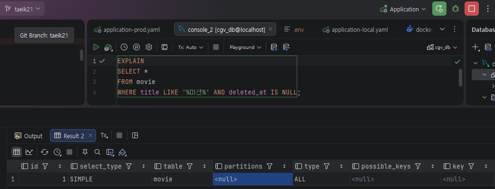
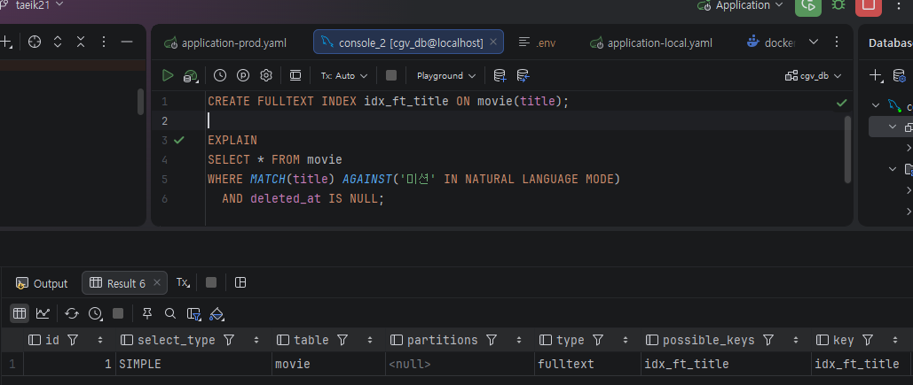
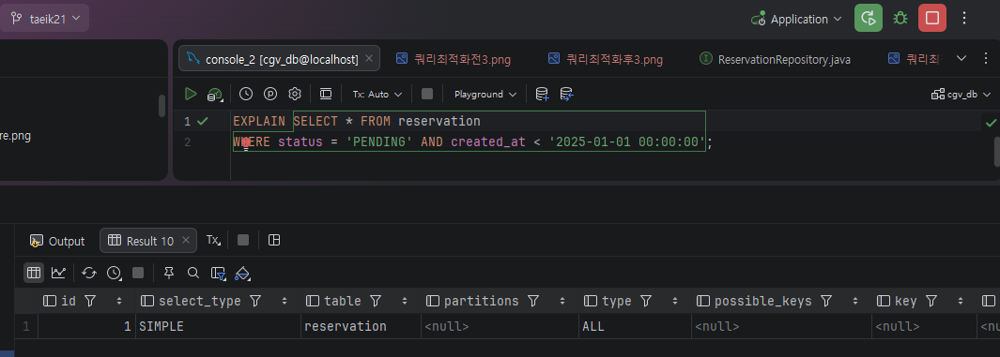
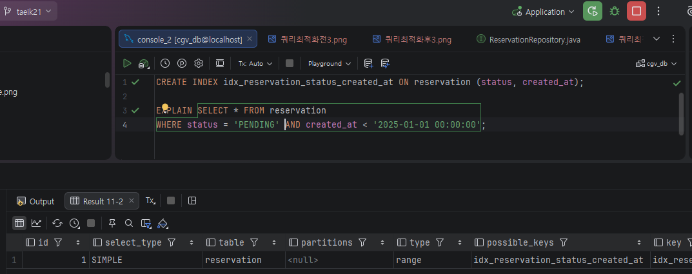
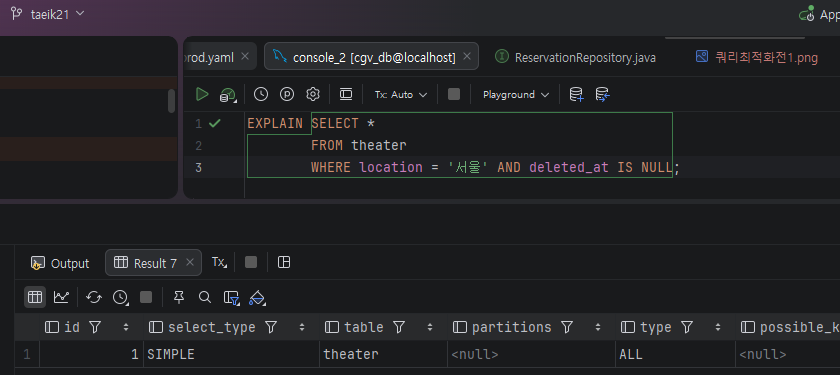
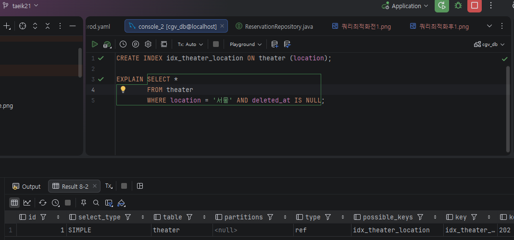

# spring-cgv-23rd
CEOS 23기 백엔드 스터디 - CGV 클론 코딩 프로젝트

## EntityManager와 DB Connection

- **EntityManager**
    - 스프링 컨테이너에 등록되는 것은 **Proxy EntityManager**
        - Proxy EM이 **싱글톤**으로 등록 되는 것
        - 빈들이 DI 받는 **EM은 Proxy EM**!!
            - 결국 하나의 Proxy EM이 모든 빈들에 공유
    - 진짜 **EntityManager**는 트랜잭션마다 **EntityManagerFactory**에 의해 생성됨
        - 클라이언트 요청이 오면 **Proxy EM**이 진짜 **EM**에게 요청 넘김
    - **결론**
        - 스프링이 싱글톤 EM 하나만을 사용하는 것 X
            - 그렇게 되면 여러 사용자의 동시 요청을 병렬적으로 수행 불가..
        - 내부적으로 **트랜잭션마다 진짜 EM이 계속 새로 생성되**며 독립적인 영속성 컨텍스트를 유지
            - **EM**마다 **영속성 컨텍스트** 관리하므로
                - 이로 인해 영속성 컨텍스트 내 데이터가 섞이지 않아, **여러 사용자의 동시 요청도 병렬 수행 가능!!**

- **EntityManager 생성 및 DB 연결** 과정
    1. **서버 시작**
        - 스프링 부트 실행
        - `application.yml`에 적어둔 DB 접속 정보를 바탕으로 `EntityManagerFactory`가 딱 하나 생성
        - **커넥션 풀에 미리 여러 커넥션들이 생성**
            - 스프링 부트에서 DB Connection 풀로 사용하는 **HikariCP** 라이브러리에 의해!!
    2. **사용자 요청 발생**
        - HTTP 요청을 처리하기 위한 **트랜잭션** 시작
    3. 빈들에게 주입된 `Proxy EntityManager`가 호출되고, 해당 요청에 할당된 진짜 `EntityManager`에게 요청 넘기기 위해 `EntityManagerFactory` 호출
    4. `EntityManager` 생성
        - `EntityManagerFactory`가 해당 요청을 처리할 `EntityManager` 생성
            - 즉 HTTP 요청마다 새로운 `EntityManager`가 생성됨!!
        - **아직 DB 커넥션을 가져오지 않음**
            - **지연된 커넥션 획득 전략** (JPA 최적화 전략)
                - 메모리(영속성 컨텍스트)에서 할 수 있는 일은 최대한 커넥션 없이 처리
    5. **비지니스 로직** 수행
        - `EntityManager`가 영속성 컨텍스트를 통해 로직 수행
            - **DB Connection** 사용 안하는 작업
                - `em.persist(member)` 호출
                    - 쓰기 지연 SQL 저장소에 쿼리 저장
    6. **DB 통신**
        - DB에 쿼리를 날려야 하는 시점에 **커넥션 풀**에서 DB Connection 획득
            - 트랜잭션 커밋 직전
            - `em.flush()`
            - JPQL 실행 전
    7. **쿼리 전송**
        - 영속성 컨텍스트에 쌓아둔 SQL을 DB로 모두 전송
    8. **요청 종료**
        - 트랜잭션이 **Commit**되고, 해당 `EntityManager`는 메모리에서 사라지고, **DB Connection**을 풀에 반납

### 컬렉션 페치 조인


- **컬렉션 페치조인에서 영속성 컨텍스트 동작 흐름**
    - **팀 테이블**에 1개 저장된 `팀 A` 조회 시, 연관된 `회원1`과 `회원2`를 **페치조인**하는 경우
        
        ```jsx
        public interface TeamRepository extends JPARepository<Team, Long> {
        		@EntityGraph(attributePaths = { "members" })
        		List<Team> findByName(String name);
        }
        ```
        
    1. **반환된 team 결과 리스트**
        - DB에서 1줄이 아니라, **2줄을 받음**
            - 일대다 관계이므로, **데이터 뻥튀기**
        - 결과 리스트(`List<Team>`)의 크기는 **2**
    2. **리스트에 객체 저장**
        - 첫 번째 줄을 읽어 `Team A` 객체 생성
        - 두 번째 줄을 읽을 때, 동일 Id 확인 (1차 캐시에 이미 저장)
            - 이미 생성된 객체의 주소 재활용
        - 결국 **리스트의** 첫 번째 요소와 두 번째 요소 모두 동일 객체 가리킴
    3. **리스트 출력**
        - 동일한 객체가 2번 출력
    
    ```jsx
    List<Team> teams = teamRepository.findByName("TEAM A");
    
    for(Team team : teams) { 
        System.out.println("teamname = " + team.getName()); 
        for (Member member : team.getMembers()) { 
          //페치 조인으로 팀과 회원을 함께 조회해서 지연 로딩 발생 안함 
          System.out.println("username =" + member.getUsername()); 
      } 
    }
    
    teamname = 팀A 
    username = 회원1 
    username = 회원2
    teamname = 팀A 
    username = 회원1 
    username = 회원2 
    ```
    
    - 중복 문제 해결 방법
        - **distinct**
            
            ```jsx
            public interface TeamRepository extends JPARepository<Team, Long> {
            		@EntityGraph(attributePaths = { "members" })
            		List<Team> findDistinctByName(String name);
            } 
            ```
            
            - **애플리케이션 레벨에서 중복 제거**
                - **Hibernate**가 같은 식별자인 Team 엔티티 제거하여, 리스트에 한 번만 저장됨
            - **DB 레벨**에서 중복 제거 안됨
                - SQL의 데이터는 같지 않으므로
        - **Hibernate6**부터 **distinct 명령어** 사용하지 않아도 자동으로 애플리케이션 레벨에서 중복 제거 해줌
            - 알아서 식별자를 보고 중복 제거
            - DB 레벨에서는 여전히 뻥튀기된 데이터가 전달
        - 그럼에도 **distinct** 명시적으로 작성하는 것을 추천!!
            - 자동 중복 제거는 JPA가 아닌 Hibernate의 기능이므로 다른 구현체로 바꾸면 중복 제거 안됨..
            - 중복 없이 가져온다는 것을 명시적으로 표현 가능

- **컬렉션 페치조인의 한계**
    - **둘 이상의 컬렉션 페치조인 불가**
        - 컬렉션마다 **카르테시안 곱** 발생
            - 팀 1개 * 멤버 10명 * 주문 10개 = 100개 행..
        - 둘 이상의 컬렉션 중복부터는 **Hibernate**가 중복 제거 불가능
            - `org.hibernate.loader.MultipleBagFetchException: cannot simultaneously fetch multiple bags`
            
    - **페이징 불가**
        - **데이터 유실 문제**
            - **일대다 페치조인**하면, 위의 경우처럼 **데이터 뻥튀기 발생**
                - 즉 DB 결과로 `팀A`가 두 줄로 반환
            - 뻥튀기된 데이터에 **페이징 걸면 데이터 유실 가능**
                - `limit 1`을 걸면 DB가 첫 줄만 보내게 됨
                - **DB 레벨**에서는 어디까지가 하나의 팀인지 모름
        - **Hibernate**의 작동 방식
            - 이러한 데이터 유실을 막기 위해 **뻥튀기된 데이터를 모두 갖고 와 메모리에서 페이징** 시도..
                - **OutOfMemory** 에러 발생 가능
                - **`firstResult/maxResults specified with collection fetch; applying in memory!`**

- **Batch Fetch**로 해결!!
    - 우선 **지연로딩으로** 가져오고, 연관된 엔티티를 필요할 때 **in 쿼리로** 여러개 가져오기
        - **페치조인** 사용 안하므로 위 문제들 발생 X
        - 페치조인 사용 안해도 **N+1** 문제 발생 X
    - **application.yml** 설정
        
        ```jsx
        jpa:
        	properties
        		hibernate:
        			default_batch_fetch_size: 100
        ```
        
    - 동작 방식
        
        ```jsx
        // Team만 조회 (페치 조인 X)
        List<Team> teams = teamRepository.findByName("TEAM A");
        
        // 지연 로딩 발생
        for (Team t : teams) {
            t.getMembers(); // in 쿼리 실행
        }
        ```
        
        - `IN` 절을 사용해서 데이터를 한 번에 미리 설정값만큼 가져옴
            - `SELECT * FROM MEMBER WHERE TEAM_ID IN (1, 2, 3, ..., 100)`
        - N+1 문제가 발생하지 않고, `1 + 1` 수준으로 최적화 가능
---
## CGV 서비스

- **ERD 모델링**
    - [CGV ERD](https://www.erdcloud.com/d/QvfvdQeEdWbPWid9b)

### 1. 즐겨찾기 (영화관 / 영화)

- **도메인**
    
    ```jsx
    user
    favorite_movie
    favorite_theater
    ```
    
    - `user`: CGV 회원
    - `favorite_movie`, `favorite_theater`: 즐겨찾기(찜) 기능
- **관계**
    
    ```jsx
    User 1:N FavoriteMovie
    User 1:N FavoriteTheater
    ```
    
    - 회원은 여러개의 영화와 영화관을 찜할 수 있음

### 2. 영화 등장인물 조회 및 리뷰 작성

- **도메인**
    
    ```jsx
    movie
    review
    actor
    director
    person
    ```
    
    - `movie`: 영화
    - `review`: 사용자 리뷰
    - `person`: 배우/감독 공통 엔티티
    - `actor`, `director`: 역할 분리
- **관계**
    
    ```jsx
    Person 1:N Actor/Director
    Actor/Director N:1 Movie
    Movie 1:N Review
    ```
    
    - `person`와 `movie`의 **다대다 관계**를 `actor`와 `director`를 통해 **일대다, 다대일 관계로 매핑**
        - 배우/감독 역할 구분
        - 배우이자 감독으로 영화에 참여하는 사람 고려
    - 영화에 여러개의 리뷰가 달릴 수 있음

### 3. 영화 조회 및 상영관에 따른 상영시간 확인

- **도메인**
    
    ```jsx
    theater
    screen
    screen_type
    schedule
    ```
    
    - `theater`: 영화관
    - `screen`: 상영관
    - `screen_type`: 특별관(IMAX, 4DX 등), 일반관
    - `schedule`: 상영 영화
- **관계**
    
    ```jsx
    Theater 1:N Screen
    Screen N:1 Screen_type
    Screen 1:N Schedule
    ```
    
    - 영화관에 여러 상영관 존재
    - 상영관은 특별관과 일반관으로 구성
    - 상영관에는 여러 영화가 상영

### 4. 좌석

- **도메인**
    
    ```jsx
    seat
    seat_grade
    seat_template
    ```
    
    - `seat`: 실제 좌석
    - `seat_grade`: 일반석 / 특별석
    - `seat_template`: 좌석 템플릿
- **관계**
    
    ```jsx
    SeatGrade 1:N Seat/Seat_template
    ```
    
    - 좌석에 여러 등급 존재
        - 좌석별 가격 차등 가능
    - 특별관, 일반관 종류가 같다면 좌석 동일하다는 조건
        - 좌석 템플릿을 통해 좌석 재사용하기 위함

### 5. 상영 영화 및 좌석 선택 후 예매 (혹은 취소)

- **도메인**
    
    ```jsx
    reservation
    reservation_seat
    ```
    
    - `reservation`: 예매
        - 상영영화 및 좌석 예매
    - `reservation_seat`: 예매 좌석
- **관계**
    
    ```jsx
    Reservation 1:N ReservationSeat
    Seat 1:N ReservationSeat
    Schedule 1:N Reservation
    ```
    
    - 한 번에 여러 좌석 예매 가능
        - `reservation`과 `seat`의 **다대다 관계**를 `reservation_seat`을 통해 **일대다, 다대일 관계로 매핑**

### 6. 매점 상품 주문

- **도메인**
    
    ```jsx
    menu
    inventory
    orders
    order_item
    ```
    
    - `menu`: 매점 상품
    - `inventory`: 지점별 재고
    - `orders`: 주문
    - `order_item`: 주문 상세
- **관계**
    
    ```jsx
    Orders 1:N OrderItem
    OrderItem N:1 Inventory
    Menu 1:N Inventory
    ```
    
    - 영화관별 재고 관리
    - 한 번에 여러 상품 주문 가능
        - `orders`와 `inventory`의 **다대다 관계**를 `order_item`을 통해 **일대다, 다대일 관계로 매핑**

---
## 웹 인증의 발전 과정

### HTTP의 치명적 단점

- 인터넷(HTTP)은 **Stateless**
    - 사용자가 한 번 요청을 보내고 서버가 응답을 주면, 서버는 사용자 기록 X
        - 로그인하고 메인 페이지로 넘어갔는데, 다시 로그인 해야함..

---

### 1. 쿠키 (Cookie)

- 페이지 이동 시마다, 다시 로그인해야하는 한계 극복하기 위해 탄생
- **클라이언트에 사용자 정보를 저장**
    - 요청마다 브라우저가 **자동으로 쿠키(사용자 정보) 포함**해 전송
- **작동 방식**
    1. 사용자 로그인(아이디/비번)
    2. 서버는 인증 후, **응답 헤더(`Set-Cookie`)에 사용자 데이터** 담아 전송
    3. 브라우저는 쿠키를 저장소에 보관
    4. 이후 브라우저가 다른 페이지에 요청할 때마다, 쿠키를 같이 서버로 전송 **(요청 헤더에 포함)**
- **장점**
    - 서버는 데이터를 기억하지 않아, 메모리 낭비 X
- **단점**
    - **보안 최악**
        - 개발자 도구창에서 쿠키 값 임의로 변경 가능
        - 브라우저 저장소에 사용자 정보 노출
            - `memberId=1`
            - 쿠키 값 예측 가능 → 다른 값으로 변경해 타 사용자의 접속 정보 이용 가능
        - **CSRF** 공격에 취약
            - 브라우저에 쿠키가 저장되면, 이후 **요청에 자동으로 쿠키 포함하는 성질 이용**
            - 공격자의 사이트에 악성 코드 클릭 시, 서버에 공격자가 원하는 요청이 쿠키가 포함되어 전송됨
                - 쿠키가 포함되어 있으므로, 인증도 성공해 요청 실행됨..

---

### 2. 세션 (Session)

- 쿠키의 보안 문제 때문에 탄생
    - **사용자 정보는 서버 메모리에 저장하고, 사용자한테는 유추할 수 없는 Session ID만 쿠키로 전송**
- **작동 방식**
    1. 사용자 로그인
    2. 서버가 **세션(서버 메모리)에 사용자 데이터 저장**
    3. 서버는 사용자에게 **Session ID(추정할 수 없는 번호)만 쿠키로 전송**
    4. 사용자가 쿠키에 **JSESSIONID**를 담아오면, 서버가 세션에서 해당 값과 일치하는 ID 찾아 인증
- **장점**
    - 브라우저에는 저장소에 의미 없는 랜덤 문자열만 저장
        - `JESSIONID=absd-12432`
        - 공격자가 조작 불가
    - JSESSIONID가 탈취되도, **서버 메모리에서 해당 데이터 없애면 해결**
- **단점**
    - 사용자가 많을 수록, 세션에 많은 데이터 저장해야 하므로 **서버 메모리에 부하 증가**
    - **확장성 문제**
        - 사용자가 많아져서 서버를 2대로 늘렸을 때, 1번 서버에서 로그인한 유저가 2번 서버로 요청을 보내면 2번 서버의 세션에 사용자 정보 없어 인증 실패됨
            - 이를 해결하기 위해 Redis 서버를 사용해야함… (구조 복잡해짐)
    - 여전히 **CSRF** 공격에 취약

---

### 3. JWT (JSON Web Token / Access Token)

- 서버가 여러 대로 쪼개지게 되며 세션의 한계가 명확해짐에 따라 탄생
- **JSON 형식의 데이터를 담아 전달하는 토큰**
    - 쿠키처럼 **Stateless** + 세션처럼 **보안에 강함**
- **작동 방식**
    1. 사용자 로그인
    2. 서버가 사용자 정보를 서버만 아는 **비밀키(Secret Key)로 서명**해 토큰 생성하고 전달
    3. 클라이언트는 이 토큰을 저장해 두고, API 요청 시 헤더에 담아 전송
    4. 서버는 **서명을 통해 위조 여부**와 **토큰 만료시간을 확인해** 인증
- **장점**
    - **Statelss**
        - **메모리 문제 X**
            - 서버는 토큰을 발급하고 기억 X
        - **확장성**
            - 서버가 늘어나도 똑같은 비밀키만 들고 있으면 모두 통과
    - **CSRF 공격에 강함**
        - 브라우저가 직접 요청 헤더에 JWT 포함해야함!!
            - 악성 코드 클릭해도, 서버에 JWT 없이 요청이 전송되어 어차피 인증 실패
- **단점**
    - 공격자가 토큰을 탈취하면, 유효기간 끝날 때까지 **토큰 제거할 방법 X**
        - 그렇다고 만료기간 짧게 잡으면 UX 안 좋아짐..

---

### 4. Refresh Token (주로 랜덤 문자열 UUID)

- **JWT의 보안과 UX 문제를 모두 해결**하기 위해 탄생
    - **유효기간이 짧은 Access Token과, 이를 재발급하는 Refresh Token 사용!!**
    
    ### Access Token
    
    - **수명**
        - **매우 짧게** 설정 (보통 15~ 30분)
        - 공격자에게 토큰 탈취되도, **피해 최소화!!**
    - **저장 위치**
        - **XSS** 공격에 대비해, **프론트엔드 메모리**에 저장
            - **Stateless**
                - 응답 속도 향상
            - 다른 저장소 X
                - 공격자가 JS를 통해 **localStorage**와 **SessionStorage**에 저장된 정보 탈취 가능
                - 쿠키에 저장 시 다시 **CSRF** 공격에 취약해짐
        - **새로고침하고나 창 껐다 키면 메모리 초기화 되므로, 사용자 데이터 사라짐**
            - **Silent Refresh**로 해결
                - **Access Token이 만료될 때마다 백그라운드에서 Refresh Token을 서버로** 보내 Access Token 재발급
    
    ### Refresh Token
    
    - Access Token이 만료되면, **새로운 Access Token을 발급받기 위한 용도**
    - **수명**
        - **매우 길게** 설정 (보통 1주 ~ 2주)
        - 공격자 탈취 위험 해결 방법
            - **Redis**
                - 발급한 Refresh Token를 서버의 Redis에 저장해 관리
                    - 공격자에게 탈취되도, Redis에 저장한 Refresh Token 삭제하면 끝
            - **RTR (Refresh Token Rotation)**
                - AccessToken 재발급할 때, **RefreshToken도 새로 발급**
                    - 기존 RefreshToken은 AccessToken 재발급 시 즉시 무효화
                - Redis에 RefreshToken을 기록하여, 재발급 요청 시 **토큰의 유효성을 검증**
                    - **같은 토큰으로 반복해서 AccessToken을 발급받는 것을 막을 수 있음**
    - **저장 위치**
        - **쿠키에 저장**
            - **Stateful**
        - 보안 옵션(`HttpOnly`, `Secure`, `SameSite`)
            - `HttpOnly`, `Secure`을 통해 **XSS** 공격 대비
                - JS로 쿠키에 접근 불가
            - `SameSite`을 통해 **CSRF** 공격 대비
                - 다른 도메인에서 온 요청엔 쿠키 안 보냄
                    - 즉, 브라우저는 공격자 사이트에서 서버로 요청시, 쿠키에 전송 X
- **AccessToken: 메모리**에 저장 + **RefreshToken: Cookie + Redis + RTR (국룰)**
    - **XSS, CSRF, 토큰 탈취**에 대해 강함!!
- **작동 방식**
    1. 로그인 성공하면 서버가 **Access Token, Refresh Token** 발급
    2. 프론트엔드는 **AT 만료 전까지 서버랑 AT를 통해** 통신
        - 서버는 검사만 하면 되므로 초고속 응답
    3. 프론트엔드가 AT를 보냈는데, **AT 만료되어 서버에서 401에러** 발생
    4. 프론트엔드는 **사용자 몰래** 백그라운드에서 쿠키에 **RT를 꺼내서 서버에 전송**
        - **Slient Refresh**
    5. 서버가 Redis에서 해당 RT 유효성 검증
    6. 검증 후, 서버는 **새 AT와 새 RT**를 프론트엔드에게 전송
        - 사용자는 해당 과정 알지 못함!!

---

### OAuth 2.0

- 탄생 배경
    - 과거에는 다른 서비스(구글, 카카오)의 정보를 가져오기 위해 유저의 아이디/비밀번호 요구
        - 보안상 최악
    - **유저의 비밀번호 노출하지 않**고, 다른 서비스(카카오, 구글)가 보증을 서
    **안전한 정보(이메일 등)만 빌려**주는 **글로벌 표준 규칙 OAuth 2.0** 탄생
- 주체
    - **Resource Owner**
        - 이메일의 진짜 주인
    - **Client**
        - 정보를 빌려 쓰고 싶은 자
    - **Authorization Server**
        - 아이디/비번을 확인하고 토큰을 발급해 주는 곳
    - **Resource Server**
        - 사용자의 이메일이 보관된 곳
- **작동 방식**
    1. **인가 코드(Authorization Code) 발급 (Front Channel)**
        1. 사용자가 우리 서비스(**Client**)에서 '카카오 로그인' 클릭
        2. 카카오 로그인 창으로 이동해 아이디/비번을 치고 **[정보 제공 동의]** 클릭
            - 사용자는 우리 서비스가 자신의 이메일을 가져가도록 허락(인가, Authorization)
        3. 카카오는 사용자를 다시 우리 서비스로 보내면서, **주소창에 Authorization Code 전송**
            - **프론트 채널**
                - 브라우저의 URL 창을 통해 데이터 이동
                - 보안 취약
            - **Authorization Code**
                - `/kakao?code=xYz123...`
                - 인가 코드는 수명이 매우 짧음
                - 단독으로 못써, 공격자에게 탈취되도 상관 X
    2. **Access Token 발급 (Back Channel)**
        1. 우리 서비스의 브라우저가 주소창의 `code`를 **우리 백엔드 서버**로 전송
        2. 우리 백엔드 서버는 카카오 서버와 **직접 Server-to-Server 통신 시작**
            - **백 채널**
                - **서버와 서버가 통신**
                - **브라우저를 거치지 않**아, 공격자는 정보 탈취 불가능
                - **백 채널에서 AccessToken 전달 위해**, 처음엔 탈취되도 상관 없는 **인가 코드 전달한 것**!!
        3. 우리 백엔드가 카카오에게 아래 정보 제공
            - **방금 받은 인가 코드**
            - **우리 앱 아이디 (Client ID)**
                - 카카오에게 발급받은 공개된 식별키(**REST  API 키)**
            - **우리 앱 전용 비밀번호(Client Secret)**
                - 우리 서버와 카카오 서버 둘 만 알고 있는 비밀번호
        4. 카카오는검증 후, 공격자가 볼 수 없는 백 채널을 통해
        **진짜 카카오 Access Token**을 우리 백엔드에 전달
    3. **사용자 정보 획득**
        1. 우리 백엔드는 카카오 Access Token를 담아 카카오 Resource Server에 요청
            - `Authorization: Bearer <카카오_Access_Token>`
        2. 카카오로부터 사용자의 이메일(`taeik@kakao.com`) 받아옴
            - 처음에 사용자가 **동의했던 정보들(이메일, 닉네임 등)을 JSON** 형태로 받음
        - 이후 카카오 Access Token 처리 방식
            - 사용자 정보 수집 목적으로만 사용 시
                - 저장하지 않음
            - 카카오 부가 기능 계속 쓰는 경우
                - 암호화해서 저장해둠
                - 예)
                    - 우리 앱에서 **카카오톡 친구에게 공유하기** 버튼
            - **절대 프론트엔드(유저)에게 주지 않음**
    4. **로그인 처리**
        1. 우리 DB를 조회해 해당 이메일이 가입되어 있는지 확인
        2. 로그인(또는 자동 회원가입) 처리
        3. 우리 백엔드의 **TokenProvider**를 통해 **우리 서비스 전용 새로운 Access Token과 Refresh Token** 생성
        4. 프론트엔드에게 AT, RT 전달
            - 프론트엔드 입장에서 **일반 로그인을 하든, 카카오 로그인을 하든** 똑같이 우리 서비스의 JWT 받아 쓰게 됨
---

## 프로젝트 인증/인가 전체 흐름

- **JWT + REST API 환경**
    - 로그인할 때
    - 토큰 들고 API 요청할 때

---

### 상황 1: 로그인을 할 때

- 사용자가 아이디와 비밀번호를 치고 `/api/auth/login`으로 요청
1. **Filter Chain Proxy**
    - 사용자의 요청이 **스프링(DispatcherServlet)**으로 가기 전, **SecurityFilterChain**에 걸림
2. **필터 통과**
    - `JwtAuthenticationFilter` 통과
        - 헤더에 토큰 없으므로, 다음 필터에 넘김
    - **SecurityFilterChain**도 통과
        - `SecurityConfig`에`.requestMatchers("/login").permitAll()`이라고 설정되어 있으므로
3. **`AuthController`에 도달**
    - 요청이 컨트롤러에 도착
        - `AuthService` 호출
4. **`AuthService`의 인증 수행**
    - DB에서 이메일로 유저 찾고, `PasswordEncoder`로 비밀번호가 맞는지 검사
5. **토큰 생성** 
    - 비밀번호가 맞다면 `TokenProvider`를 불러와서 유저의 PK와 권한을 담아 **JWT(Access/Refresh Token) 생성**
6. **토큰을 담아 응답 전송**
    - 만들어진 토큰을 JSON에 담아 프론트엔드에게 전송
        - 프론트엔드는 이 토큰을 메모리나 쿠키에 저장

---

### 상황 2-1: 발급받은 토큰으로 API를 호출할 때 (인증 흐름)

- 프론트엔드가 Access Token을 HTTP 헤더(`Authorization: Bearer <토큰>`)에 담아 내 정보 조회 API(`/api/auth/me`) 호출
1. **`JwtAuthenticationFilter` 호출**
    - 직접 만든 커스텀 필터가 요청을 낚아챔
    - 헤더에 토큰 확인 후, 'Bearer ' 떼고 순수 토큰만 추출
2. **토큰 검증**
    - 추출한 토큰을 `TokenProvider`의 `isAccessToken`을 통해 토큰 검증
        - 토큰 여부, 서명, 만료 기간 등
    - 정상 토큰이라면, 토큰의 Payload 안에 있는 유저 PK(`userId`)와 권한(`ROLE_USER`) 추출
3. 토큰을 통해 **유저 인증 정보** 생성
    - 꺼낸 유저 정보를 바탕으로 `CustomUserDetails` 객체 생성
    - `SecurityContext`에 저장하기 위해 `UsernamePasswordAuthenticationToken` 객체에 담음
4. **전역 저장소에 저장**
    - `Authentication`(유저 정보)를 **`SecurityContext`에 저장**
        - `SecurityContext`에 저장되어야 **Spring Security**는 인증됐다고 판단
5. `JwtAuthenticationFilter` 통과
    - **`filterChain.doFilter`**
        - 다음 필터로 요청을 넘김

### 상황 2-2: 권한 검사 및 예외 처리 (인가 흐름)

- 인증 필터를 통과 후, **`AuthorizationFilter`**와 **`ExceptionTranslationFilter`**가 남음..
1. **최종 인가 검사 (`AuthorizationFilter`)**
    - `SecurityContext` 에 저장된 `Authentication` 확인해 권한 최종적으로 확인
        - `/api/users/me` API는 로그인한 사람만 들어갈 수 있음
            - `SecurityContext` 내 `Authentication` 확인
        - `/api/users/me` API는 관리자 전용
            - `Authentication` 내 Role 확인
2. **에러 발생**
    - 만약 위 검사에서 걸리면, 컨트롤러로 안 넘어가고 예외가 터짐
        - 이 예외를 `ExceptionTranslationFilter`가 처리
    - `SecurityContext`에 `Authentication` 없을 때 (401 에러)
        - **`CustomAuthenticationEntryPoint`** 호출
    - 유저 정보는 있는데, 권한이 없을 떄 (403 에러)
        - **`CustomAccessDeniedHandler`**를 호출

### 상황 2-3: 컨트롤러 도달 및 로직 수행

1. **`AuthController`에 요청 도달**
    - 필터 체인을 통해 인증, 인가 처리 후 스프링 컨트롤러에 요청 도달
2. **`@AuthenticationPrincipal`**
    - **전역 저장소(`SecurityContext`)에 넣어두었던 유저 정보를 파라미터로 넣어줌**
        - DB 조회 없이 `userDetails.getUserId()`를 바로 사용 가능!!
---
## 코드 리팩토링

### `TheaterService` 리팩토링

1. `updateTheater`
- **KISS**
    - 조건이 복잡해 이해하기 힘든 로직을 `validateDuplicateTheaterName`으로 분리해, 메서드 명으로 쉽게 파악 가능
- **SRP**
    - **극장을 조회**하는 로직과 **중복된 극장명 검증** 로직을 **극장 업데이트** 로직과 분리

**리팩토링 전**

```jsx
@Transactional
public TheaterInfo updateTheater(Long id, TheaterUpdateCommand command) {
    Theater theater = theaterRepository.findByIdAndDeletedAtIsNull(id)
            .orElseThrow(() -> new BusinessException(ErrorCode.THEATER_NOT_FOUND));

    if (!theater.getName().equals(command.name()) && theaterRepository.existsByNameAndDeletedAtIsNull(command.name()))
        throw new BusinessException(ErrorCode.DUPLICATE_THEATER_NAME);

    theater.update(command.name(), command.location());

    return TheaterInfo.from(theater);
}
```

**리팩토링 후**

```jsx
@Transactional
public TheaterInfo updateTheater(Long id, TheaterUpdateCommand command) {
		// 리팩토링된 부분
    Theater theater = findExistedTheater(id);

		// 리팩토링된 부분
    validateDuplicateTheaterName(theater, command.name());

    theater.update(command.name(), command.location());

    return TheaterInfo.from(theater);
}

private Theater findExistedTheater(Long id) {
    return theaterRepository.findByIdAndDeletedAtIsNull(id)
            .orElseThrow(() -> new BusinessException(ErrorCode.THEATER_NOT_FOUND));
}

private void validateDuplicateTheaterName(Theater theater, String name) {
    if (!theater.getName().equals(name) && theaterRepository.existsByNameAndDeletedAtIsNull(name))
        throw new BusinessException(ErrorCode.DUPLICATE_THEATER_NAME);
}
```

2. `createTheater`
- **KISS**
    - 복잡한 람다식을 간단하게 **메서드 추출**을 통해 간단하게 표현
- **SRP**
    - **삭제된 극장을 복구**하는 로직과 **새 극장을 생성** 로직을 **극장 생성** 로직과 분리

**리팩토링 전**

```jsx
@Transactional
public TheaterInfo createTheater(TheaterCreateCommand command) {
    if (theaterRepository.existsByNameAndDeletedAtIsNull(command.name()))
        throw new BusinessException(ErrorCode.DUPLICATE_THEATER_NAME);

    return theaterRepository.findByNameAndDeletedAtIsNotNull(command.name())
            .map(existedTheater -> {
                existedTheater.restoreDelete();
                existedTheater.update(command.name(), command.location());
                return TheaterInfo.from(existedTheater);
            })
            .orElseGet(()->{
                Theater newTheater = Theater.builder()
                        .name(command.name())
                        .location(command.location())
                        .build();
                theaterRepository.save(newTheater);
                return TheaterInfo.from(newTheater);
                    }
            );
}
```

**리팩토링 후**

```jsx
@Transactional
public TheaterInfo createTheater(TheaterCreateCommand command) {
    if (theaterRepository.existsByNameAndDeletedAtIsNull(command.name()))
        throw new BusinessException(ErrorCode.DUPLICATE_THEATER_NAME);

		// 리팩토링된 부분
    Optional<Theater> deletedTheater 
		    = theaterRepository.findByNameAndDeletedAtIsNotNull(command.name());
		    
		// 리팩토링된 부분
    return deletedTheater
            .map(theater -> restoreTheater(theater, command))
            .orElseGet(() -> createNewTheater(command));
}

private TheaterInfo restoreTheater(Theater deletedTheater, TheaterCreateCommand command){
    deletedTheater.restoreDelete();
    deletedTheater.update(command.name(), command.location());
    return TheaterInfo.from(deletedTheater);
}

private TheaterInfo createNewTheater(TheaterCreateCommand command) {
    Theater newTheater = Theater.builder()
            .name(command.name())
            .location(command.location())
            .build();
    theaterRepository.save(newTheater);
    return TheaterInfo.from(newTheater);
}
```

### `MovieService` 리팩토링

`upateMovie`
- **Rich domain**
    - `Movie` 엔티티에  비지니스 로직 포함시키기

**리팩토링 전**

```jsx
@Transactional
public MovieInfo updateMovie(Long id, MovieUpdateCommand command) {
    Movie movie = findMovieById(id);

    boolean isUniqueKeyChanged = !movie.getTitle().equals(command.title()) ||
            !movie.getReleaseDate().isEqual(command.releaseDate());

    if (isUniqueKeyChanged) {
        if (movieRepository.existsByTitleAndReleaseDate(command.title(), command.releaseDate()))
            throw new BusinessException(ErrorCode.DUPLICATE_MOVIE);
    }

    movie.update(
            command.title(),
            command.runtime(),
            command.releaseDate(),
            command.ageRating(),
            command.posterUrl(),
            command.description()
    );

    return MovieInfo.from(movie);
}
```

**리팩토링 후**

```jsx
@Entity
@Getter
@Table(uniqueConstraints = {
        @UniqueConstraint(name = "UQ_Movie", columnNames = {"title", "release_date"})
})
@NoArgsConstructor(access = AccessLevel.PROTECTED)
public class Movie extends BaseSoftDeleteEntity {
    ...
		// 리팩토링된 부분
    public boolean uniqueKeyChanged(String title, LocalDate releaseDate) {
        return !this.title.equals(title) ||
                !this.releaseDate.isEqual(releaseDate);
    }
}
```

```jsx
@Transactional
public MovieInfo updateMovie(Long id, MovieUpdateCommand command) {
    Movie movie = findMovieById(id);

		// 리팩토링된 부분
    if (movie.uniqueKeyChanged(command.title(), command.releaseDate())) {
        if (movieRepository.existsByTitleAndReleaseDate(
				        command.title(), command.releaseDate()))
            throw new BusinessException(ErrorCode.DUPLICATE_MOVIE);
    }

    movie.update(
            command.title(),
            command.runtime(),
            command.releaseDate(),
            command.ageRating(),
            command.posterUrl(),
            command.description()
    );

    return MovieInfo.from(movie);
}
```

### `OrderService` 리팩토링

`createOrder` 리팩토링
- **Rich domain**
    - `Order`, `OrderItem` 엔티티에  비지니스 로직 포함시키기

**리팩토링 전**

```jsx
@Transactional
public OrderInfo createOrder(OrderCommand command) {
    User user = userRepository.findByEmailAndDeletedAtIsNull(command.email())
            .orElseThrow(() -> new BusinessException(ErrorCode.USER_NOT_FOUND));

    Theater theater = theaterRepository.findByIdAndDeletedAtIsNull(command.theaterId())
            .orElseThrow(() -> new BusinessException(ErrorCode.THEATER_NOT_FOUND));

    int totalPrice = 0;
    List<OrderItem> orderItems = new ArrayList<>();

    for (OrderItemCommand itemCommand : command.orderItems()) {
        Menu menu = menuRepository.findByIdAndDeletedAtIsNull(itemCommand.menuId())
                .orElseThrow(() -> new BusinessException(ErrorCode.MENU_NOT_FOUND));

        Inventory inventory = inventoryRepository.findByTheaterIdAndMenuIdWithLock(theater.getId(), menu.getId())
                .orElseThrow(() -> new BusinessException(ErrorCode.INVENTORY_NOT_FOUND));

        inventory.decreaseStock(itemCommand.count());

        int currentOrderPrice = menu.getPrice();
        totalPrice += (currentOrderPrice * itemCommand.count());

        OrderItem orderItem = OrderItem.builder()
                .menu(menu)
                .orderPrice(currentOrderPrice)
                .count(itemCommand.count())
                .build();
        orderItems.add(orderItem);
    }

    Order order = Order.builder()
            .user(user)
            .theater(theater)
            .totalPrice(totalPrice)
            .refundable(false)
            .build();
    orderRepository.save(order);

    for (OrderItem orderItem : orderItems) {
        orderItem.updateOrder(order);
    }
    orderItemRepository.saveAll(orderItems);

    return OrderInfo.from(order, orderItems);
}
```

**리팩토링 후**

```jsx
@Entity
public class OrderItem extends BaseSoftDeleteEntity {
    ...
    // 리팩토링된 부분
    public static OrderItem create(Menu menu, int count) {
        return OrderItem.builder()
                .menu(menu)
                .orderPrice(menu.getPrice())
                .count(count)
                .build();
    }

		// 리팩토링된 부분	
    public void updateOrder(Order order) {
        this.order = order;
    }
}
```

```jsx
@Entity
public class Order extends BaseTimeEntity {
	  ...
	  // 리팩토링된 부분
    @OneToMany(mappedBy = "order", cascade = CascadeType.ALL, orphanRemoval = true)
    private List<OrderItem> orderItems = new ArrayList<>();
		
		// 리팩토링된 부분
    public static Order create(User user, Theater theater, List<OrderItem> orderItems) {
        Order order = Order.builder()
                .user(user)
                .theater(theater)
                .refundable(false)
                .build();

        int totalPrice = 0;
        for (OrderItem item : orderItems) {
            order.addOrderItem(item);
            totalPrice += (item.getOrderPrice() * item.getCount());
        }
        order.totalPrice = totalPrice;

        return order;
    }

		// 리팩토링된 부분
    private void addOrderItem(OrderItem orderItem) {
        this.orderItems.add(orderItem);
        orderItem.updateOrder(this);
    }
}
```

```jsx
@Transactional
public OrderInfo createOrder(OrderCommand command) {
    User user = userRepository.findByEmailAndDeletedAtIsNull(command.email())
            .orElseThrow(() -> new BusinessException(ErrorCode.USER_NOT_FOUND));

    Theater theater = theaterRepository.findByIdAndDeletedAtIsNull(command.theaterId())
            .orElseThrow(() -> new BusinessException(ErrorCode.THEATER_NOT_FOUND));
    
    // 리팩토링된 부분
    List<OrderItem> orderItems = command.orderItems().stream()
            .map(itemCommand -> {
                Menu menu = menuRepository.findByIdAndDeletedAtIsNull(itemCommand.menuId())
                        .orElseThrow(() -> new BusinessException(ErrorCode.MENU_NOT_FOUND));

                Inventory inventory = inventoryRepository.findByTheaterIdAndMenuIdWithLock(theater.getId(), menu.getId())
                        .orElseThrow(() -> new BusinessException(ErrorCode.INVENTORY_NOT_FOUND));

                inventory.decreaseStock(itemCommand.count());

                return OrderItem.create(menu, itemCommand.count());
            }).toList();

		// 리팩토링된 부분
    Order order = Order.create(user, theater, orderItems);
    
    orderRepository.save(order);
    
    return OrderInfo.from(order, orderItems);
}
```

### `ReservationService` 리팩토링

`createReservation` 리팩토링
- **Rich domain**
    - `RservedSeat`, `Reservation` 엔티티에  비지니스 로직 포함시키기
- **SRP**
    - **좌석 유무 검증** 로직과 **좌석 예약 여부 검증** 로직을  **예약 생성** 로직과 분리

**리팩토링 전**

```jsx
@Transactional
public ReservationInfo createReservation(ReservationCreateCommand command) {
    User user = userRepository.findByIdAndDeletedAtIsNull(command.userId())
            .orElseThrow(()-> new BusinessException(ErrorCode.USER_NOT_FOUND));

    Schedule schedule = scheduleRepository.findByIdAndDeletedAtIsNull(command.scheduleId())
            .orElseThrow(() -> new BusinessException(ErrorCode.SCHEDULE_NOT_FOUND));

    schedule.validateReservableTime(LocalDateTime.now());

    Long screenId = schedule.getScreen().getId();

    List<Seat> seats = seatRepository.findAllByIdAndScreenIdAndDeletedAtIsNullWithLock(command.seatIds(), screenId);
    if (seats.size() != command.seatIds().size()) {
        throw new BusinessException(ErrorCode.INVALID_SEAT);
    }

    boolean isAlreadyReserved = reservedSeatRepository.existsByScheduleIdAndSeatIdInAndReservationStatus(
            schedule.getId(),
            command.seatIds(),
            ReservationStatus.RESERVED
    );

    if (isAlreadyReserved) {
        throw new BusinessException(ErrorCode.SEAT_ALREADY_RESERVED);
    }

    int screenSurcharge = schedule.getScreen().getScreenType().getSurchargePrice();
    int baseSeatPrice = schedule.getBasePrice() + screenSurcharge;

    Map<Seat, Integer> seatPriceMap = new HashMap<>();
    int totalPrice = 0;

    for (Seat seat: seats) {
        int seatSurcharge = seat.getSeatGrade().getSurchargePrice();

        int seatPrice = baseSeatPrice + seatSurcharge;
        seatPriceMap.put(seat, seatPrice);

        totalPrice += seatPrice;
    }

    Reservation reservation = Reservation.builder()
            .user(user)
            .schedule(schedule)
            .status(ReservationStatus.RESERVED)
            .totalPrice(totalPrice)
            .build();
    reservationRepository.save(reservation);

    List<ReservedSeat> reservedSeats = seats.stream()
            .map(seat -> ReservedSeat.builder()
                    .reservation(reservation)
                    .seat(seat)
                    .schedule(schedule)
                    .price(seatPriceMap.get(seat))
                    .build())
            .toList();
    reservedSeatRepository.saveAll(reservedSeats);

    return ReservationInfo.from(reservation, reservedSeats);
}
```

**리팩토링 후**

```jsx
@Entity
public class ReservedSeat extends BaseSoftDeleteEntity {
    ...
    // 리팩토링된 부분
    public static ReservedSeat create(
				    Reservation reservation, Schedule schedule, Seat seat) {
				    
        int screenSurcharge = schedule.getScreen().getScreenType().getSurchargePrice();
        int baseSeatPrice = schedule.getBasePrice() + screenSurcharge;
        int seatSurcharge = seat.getSeatGrade().getSurchargePrice();
        int finalPrice = baseSeatPrice + seatSurcharge;

        return ReservedSeat.builder()
                .reservation(reservation)
                .schedule(schedule)
                .seat(seat)
                .price(finalPrice)
                .build();
    }

		// 리팩토링된 부분
    public void updateReservation(Reservation reservation) {
        this.reservation = reservation;
    }
}
```

```jsx
@Entity
public class Reservation extends BaseTimeEntity {
    ...
		// 리팩토링된 부분
    @OneToMany(mappedBy = "reservation", cascade = CascadeType.ALL, orphanRemoval = true)
    private List<ReservedSeat> reservedSeats = new ArrayList<>();

		// 리팩토링된 부분
    public static Reservation create(User user, Schedule schedule, List<Seat> seats) {
        Reservation reservation = Reservation.builder()
                .user(user)
                .schedule(schedule)
                .status(ReservationStatus.RESERVED)
                .build();

        int totalPrice = 0;
        for (Seat seat : seats) {
            ReservedSeat reservedSeat = ReservedSeat.create(reservation, schedule, seat);
            reservation.addReservedSeat(reservedSeat);

            totalPrice += reservedSeat.getPrice();
        }

        reservation.totalPrice = totalPrice;
        return reservation;
    }

		// 리팩토링된 부분
    private void addReservedSeat(ReservedSeat reservedSeat) {
        this.reservedSeats.add(reservedSeat);
        reservedSeat.updateReservation(this);
    }
}
```

```jsx
@Transactional
public ReservationInfo createReservation(ReservationCreateCommand command) {
    User user = userRepository.findByIdAndDeletedAtIsNull(command.userId())
            .orElseThrow(()-> new BusinessException(ErrorCode.USER_NOT_FOUND));

    Schedule schedule = scheduleRepository.findByIdAndDeletedAtIsNull(command.scheduleId())
            .orElseThrow(() -> new BusinessException(ErrorCode.SCHEDULE_NOT_FOUND));

    schedule.validateReservableTime(LocalDateTime.now());

    Long screenId = schedule.getScreen().getId();
		
		// 리팩토링된 부분
    List<Seat> seats = getValidSeats(command.seatIds(), schedule.getScreen().getId());
    
    // 리팩토링된 부분
    validateSeatNotReserved(schedule.getId(), command.seatIds());

		// 리팩토링된 부분
    Reservation reservation = Reservation.create(user, schedule, seats);
    
    reservationRepository.save(reservation);

    return ReservationInfo.from(reservation, reservation.getReservedSeats());
}

private List<Seat> getValidSeats(List<Long> seatIds, Long screenId) {
    List<Seat> seats 
		    = seatRepository.findAllByIdAndScreenIdAndDeletedAtIsNullWithLock(
				    seatIds, screenId
		    );
    if (seats.size() != seatIds.size()) {
        throw new BusinessException(ErrorCode.INVALID_SEAT);
    }
    return seats;
}

private void validateSeatNotReserved(Long scheduleId, List<Long> seatIds) {
    boolean isAlreadyReserved 
		    = reservedSeatRepository.existsByScheduleIdAndSeatIdInAndReservationStatus(
            scheduleId,
            seatIds,
            ReservationStatus.RESERVED
		    );
		    
    if (isAlreadyReserved) {
        throw new BusinessException(ErrorCode.SEAT_ALREADY_RESERVED);
    }
}
```

## DB Lock

### **낙관적 락 (Optimistic Lock)**

> **충돌이 안 일어날 것이라고 낙관적으로 가정**
> 
- 특징
    - 실제 **데이터베이스의 락 기능을 사용 X**
    - 대신 테이블에 **버전 상태를 기록하는 열**을 추가하여, **애플리케이션 단**에서 데이터가 변경되었는지 감지하는 락
        - `@Version`
- **동작 방식**
    1. 데이터를 읽을 때 버전 번호를 같이 읽음 
    2. 데이터를 수정할 때 처음에 읽었던 버전과 현재 DB의 버전이 일치하는지 확인
    3. 일치할 때만 버전을 증가시키고, 데이터 수정
- **장점:** DB에 실제 락을 걸지 않으므로 동시 처리 성능 매우 좋음
- **단점:** 업데이트 시점에 충돌이 발생할 수 있으므로, 재시도 로직이나 예외 처리를 구현해야함
- **사용 시점**
    - **충돌이 거의 발생하지 않는 상황**
    - **조회 비중이 수정보다 압도적으로 높을 때**
- **예)**
    - 프로필 정보 수정
    - 공지사항 게시글 수정

### **비관적 락 (Pessimistic Lock)**

> **무조건 충돌이 일어난다고 비관적으로 가정**
> 
- 특징
    - 트랜잭션이 시작될 때 **데이터베이스가 제공하는 실제 DB 락(주로 배타 락)** 걸음
        - 내가 데이터를 수정하는 동안, 다른 사람은 데이터를 읽거나 수정하기 위해 대기
    - SQL의 `FOR UPDATE` 구문을 사용하여 **행 단위를 잠금**
        - `@Lock(LockModeType.PESSIMISTIC_WRITE)`
- **장점:** 데이터의 무결성을 완벽하게 보장 (충돌 자체가 발생 X)
- **단점**
    - 다른 트랜잭션들이 대기해야하므로 성능(동시 처리량)이 떨어짐
    - 데드락 위험이 높음
        - 거의 동시에 실행된 두 메서드가 동일한 엔티티들을 **수정하려는 순서**가 달라 서로가 필요한 락을 획득하게 된 경우
        - 수정하기 전에 정렬을 하거나, 타임아웃 구현해야함
- **사용 시점**
    - **수정 시도가 동시에 몰릴 때 (충돌 빈번)**
        - **낙관적 락**을 쓰면 계속 충돌이 나서 재시도 하느라 리소스(CPU, DB 커넥션) 낭비
    - **데이터 정합성이 중요할 때 (결제, 재고 차감 등)**
        - DB 행 자체를 잠그는게 제일 안전!!
- 예)
    - **선착순 이벤트:** 짧은 시간에 수만 명이 한정된 자원을 선점하려고 경쟁
    - **계좌 이체:** 입금과 출금이 동시에 일어날 때 정확한 잔액 계산

### **네임드 락 (Named Lock)**

> **특정 이름(문자열)을 가진 키 선점해 락 획득**
> 
- 특징
    - DB의 Lock Manager로 부터 락 획득
        - 테이블의 특정 행이나 테이블을 잠그는 것 X
    - 락의 키 값은 주로 **락을 걸고 싶은 자원이나 행위** 단위로 정의
- **동작 방식 (MySQL의 경우)**
    1. 1인 1매 중복 클릭(따닥) 방지하고 싶은 경우
        - `SELECT GET_LOCK('user_1_coupon', 10);`
            - 서버는 **DB의 Lock Manager**로부터 `user_1_coupon`이라는 락 획득
                - 해당 락 없으면 `10`초 대기
                - **대기하는 동안 DB 커넥션 계속 잡고 있음..**
        - 유저가 네임드 락으로 `user_1_coupon` 잡고 있어도, **쿠폰 테이블 자체는 접근 가능**
            - 따라서 2번 유저, 3번 유저는 아무런 대기 없이 정상적으로 쿠폰 테이블에 자신의 쿠폰 Insert 가능
        - **오직 같은 이름표를 찾는 사람만 대기**
            - 만약 또 다른 서버(다중 서버의 경우)가 `user_1_coupon` 요청하면, 그때만 대기시킴
    2. 전체 재고 보호하고 싶은 경우
        - 수량이 한정된 글로벌 재고를 깎아야 하는 경우, 위 경우처럼 유저별로 락을 열어주면 X
            - 남은 재고가 1장일 때 유저 A와 유저 B가 동시에 각자의 락을 쥐고 들어와서 재고를 깎아버리면 **초과 발급(-1장) 버그**
        - **모든 유저에게 통용되도록 키 이름을 하나로 통일**
            - `SELECT GET_LOCK('coupon_event', 10);`
        - 여러 명이 동시에 클릭해도 키는 모든 유저에게 공통적으로 1개이므로, 무조건 1명씩 순서대로 비즈니스 로직 수행
- **장점**
    - 데이터베이스의 데이터와 무관하게 추상적인 개념에 대해 락 가능
    - timeout 구현하기 쉬움
        - 락 얻기 위해 기다리는 시간
    - Redis 분산 락을 위한 인프라 비용 없음
- **단점**
    - 트랜잭션이 종료된다고 락이 자동으로 풀리지 않음
        - 직접 `RELEASE_LOCK()`을 호출해서 해제해야 함
    - 커넥션 풀 관리 어려움
        - 커넥션 고갈을 막기 위해 
        **락을 획득하기 위한 커넥션**과 **실제 로직을 수행하는 커넥션 분리**해야함
        - 분리 안하면 락을 획득하는라 로직을 수행할 커넥션 고갈될 수도..
- **사용 시점**
    - **분산 환경에서의 동기화**
        - 여러 대의 서버가 하나의 DB를 공유할 때, 
        특정 자원에 대해 전체 시스템에서 딱 하나만 실행되도록 보장해야 할 때
    - **DB 레코드가 아직 존재하지 않을 때**
        - 비관적,낙관적 락은 존재하는 DB에 존재하는 행을 잠그지만,
        - 네임드 락은 임의의 문자열을 잠그므로, **데이터가 생성되기 전에 중복 방지 가능**
    - **외부 API 호출 제한**
        - 특정 유저가 외부 API를 연타해서 여러번 호출하는 것을 막음
            - 해당 행위에 대해 락 걸면 됨
- 예)
    - **선착순 쿠폰 중복 발급 방지**
---
### Redis 분산락

> 네임드 락에서 **DB가 해주던 락 관리 
 → 메모리 전용 서버 Redis로 옮긴 것**
> 

현대 백엔드 아키텍처(**MSA**나 **대용량 트래픽** 환경)에서
동시성 문제를 해결하는 **표준으로 Redis 분산 락 사용**
- **Redis**
    - 데이터를 메모리에 저장해서 엄청나게 빠름
    - **싱글 스레드**로 동작
        - 한 번에 하나의 명령어만 순차적으로 처리
- **동작 방식**
    1. 서버 1과 서버 2가 동시에 동일한 키를 선점하려고 시도
    2. Redis는 싱글 스레드 → 동시에 키 접근 자체가 불가
        - 먼저 도착한 서버 1의 요청만 성공, 서버 2의 요청은 실패
    3. 성공한 서버 1은 비즈니스 로직을 수행하고, 끝나면 Lock 해제
- Redis 락 구현 방식(라이브러리)
    - **Lettuce (비추천)**
        - 락을 얻을 때까지 서버가 `while(true)`문을 돌며 Redis에게 락 사용 여부 계속 확인
            - Redis 서버 부하
    - **Redisson (추천)**
        - 락이 풀리면 Redis는 대기하고 있던 서버들에게 알림 보냄
            - 스레드가 무한 루프를 돌지 않아 Redis에 부하 X
            - 락 획득 대기 시간(Timeout)이나 락 유지 시간(Lease Time)을 쉽게 설정 가능
- 장점
    - 기능적으로 DB 네임드 락과 동일하지만, **안정성과 성능** 훨씬 좋음
    1. **DB 커넥션 보호**
        - 비관적, 네임드 락은 락을 얻기 위해 대기하는 동안 **DB 커넥션**을 계속 잡고 있음
            - 대규모 트래픽이 몰리면 DB 커넥션 풀이 고갈되어 전체 서비스 마비
        - Redis 락은 이 부하를 DB와 분리!!
    2. **DB와 독립적**
    - 비관적 락의 타임아웃 시간, 네임드 락의 락 가져오는 명령어 등 모두 DB에 종속적
        - 즉, DB마다 사용 명령어 다름..
    - **Redis 분산락**을 사용하면, 어느 DB든 동일 로직 사용 가능!!
    3. **TTL 기능**
        - **DB 락**은 락 최대로 잡을 수 있는 시간 설정하는 기능 제공 X (별도 구현 필요)
            - 서버가 락을 잡고있다가 서버 자체가 다운되면, 락 계속 잡고 있게 됨
        - **Redisson**은 `Lease Time` 제공
            - 정해진 시간이 지나면 락이 **자동으로 소멸**되도록 안전하게 설계
    4. **인메모리 속도**
        - 디스크를 기반으로 하는 DB보다
        **메모리 기반의 Redis**가 락을 획득하고 반납하는 속도가 훨씬 빠름
    - 단점
        - Redis 인프라 구축 비용
---
## 영화관 예매 서비스 특징

**트래픽 많음**

→ 유명 영화 예매 시작과 동시에 여러 사용자가 명당 자리 클릭 (무조건 충돌 발생)

1. **낙관적 락**
    - 충돌할 때마다, 계속해서 재시도 로직 수행되므로 CPU, DB 커넥션 낭비
2. **비관전 락, 네임드 락**
    - DB에 접근해 락을 획득하기 때문에 DB에 부하 발생
        - 충돌을 막는 것 또한 DB에서 처리하므로
    - DB는 디스크 기반으로 락 획득 속도 느림(메모리 기반 Redis보다)

### Redis 분산 락

1. **DB 보호**
    - DB가 아닌 메모리 기반 Redis가 락 관리해줌
2. **빠른 처리**
    - 수만 명의 요청에 대한 락 관리를 Redis가 순식간에 처리
        - 많은 양의 트래픽 처리에 용이
3. **TTL 기능**
    - 유저가 좌석 선택 후 결제 안 하거나 브라우저를 꺼도, 시간 만료되면 Redis가 알아서 해당 락 제거
        - 별도 로직 없이 데드락 차단 가능
---
## 영화 예매 로직 흐름

### 1. `ReservationLockFacade`

1. **요청 수신 및 ID 정렬**
    - 사용자가 선택한 좌석 ID 리스트 정렬
        - 데드락 방지
2. **Redis Key 리스트 생성**
    - 정렬된 ID를 기반으로 좌석별 고유한 Redis Key(`lock:schedule:{id}:seat:{id}`)를 생성
        - `(shedule, seat)`은 DB에서 unique 제약 조건 존재
3. **역할 분리**
    - 생성된 **Key 리스트 및 `ReservationService의 createReservation()` 메서드**를 
    `RedisLockManager`에 전달
        - `RedisLockManger`는 그저 전달받은 키를 통해 락을 획득하고, 메서드를 실행

### 2. `RedisLockManager`

1. **MultiLock 생성**
    - 전달받은 Key 리스트를 통해 `RedissonMultiLock` 객체 생성
2. **락 획득 (`tryLock()`)**
    - `waitTime = 0`
        - 1개의 좌석이라도 다른 사용자가 선점 중이라면 대기 없이 즉시 예외
    - `leaseTime = -1`
        - Redisson의 Watchdog 기능
            - 비즈니스 로직이 끝날 때까지 락을 안전하게 유지해주며 서버 다운 시에만 락이 만료
3. **로직 실행**
    - 락 획득에 성공하면 전달 받은 비지니스 로직 실행
        - **`createReservation()` 실행**
4. **락 반납**
    - 로직이 끝나면 `finally` 블록에서 획득한 모든 락 전부 반납
---
## HTTP 클라이언트

- **일반적인 동기/외부 API 호출** → **`RestClient`**
- **MSA 환경 내부 통신** → **`Feign Client`**
- **비동기/대규모 트래픽** → **`WebClient`**

### 1. RestTemplate → X

> 스프링의 가장 전통적인 **동기식** HTTP 클라이언트
> 

이젠 `RestTemplate` 대신, `WebClient`나 `RestClient` 사용 권장

- **장점**
    - `spring-boot-starter-web`에 기본 포함
- **단점**
    - Http 헤더를 추가하거나 에러를 처리하는 코드 길고 복잡 등

### 2. Java HttpClient → X

> JDK에 내장된 **동기, 비동기** HTTP 클라이언트
> 
- **사용 시점**
    - 일반적인 스프링 웹 애플리케이션 개발에서 잘 사용 X
    - 스프링 프레임워크를 아예 안 쓰거나, 외부 라이브러리 의존성을 줄여야 하는 라이브러리 개발할 때나 사용
- **장점**
    - 스프링 프레임워크나 외부 라이브러리 없이 순수 Java만으로 사용
    - **동기, 비동기 모두 지원**
- **단점**
    - 객체를 JSON으로 직렬화, 역직렬화하는 과정을 스프링이 자동으로 해주지 않아 직접 구현해야함..

### 3. Spring Cloud OpenFeign (Feign Client)

> **Spring Cloud 생태계 기반 동기식 클라이언트**
> 
- 사용 시점
    - 주로 **MSA** 환경에서 **내부 서비스 간 통신**에 **많이 사용**
- **장점**
    - **Spring Cloud 생태계와 쉽게 연동 가능**
        - **Spring Cloud**
            - **MSA**를 쉽게 구축할 수 있도록 지원하는 **Toolkit**
            - 서비스를 여러 개로 쪼개는 **MSA** 환경에서 서비스 간 통신, 장애 관리 등 관리해야 할 여러 문제를 쉽게 해결 가능
- **단점**
    - **동기 기반**
        - 기본적으로 요청을 보내고 응답이 올 때까지 스레드가 대기
        - 비동기 지원이 추가되고 있지만, 기본 생태계는 동기 중심
    - **무거운 의존성**
        - 단순히 외부 API 호출할 때 **Spring Cloud 의존성**을 추가하기는 무거움
            - `spring-cloud-starter-openfeign'`
            - Feign 뿐만 아니라 Spring Cloud와 연동을 위한 라이브러리 모두 포함

### 4. WebClient

> **비동기** HTTP 클라이언트
> 
- **사용 시점**
    - 동시 사용자로 인해 **서버 스레드가 부족**한 상황
    - **외부 API 응답이 느려** 우리 서버까지 같이 멈추는 현상 발생할 때 사용
- **장점**
    - 적은 스레드로도 많은 동시 요청을 처리
        - 트래픽이 많거나 응답이 오래 걸리는 외부 API를 호출할 때 성능 좋음
    - **체이닝 방식**을 사용해 코드가 유연하고 깔끔
- **단점**
    - 비동기 처리로 인한 로직 복잡함
    - - `spring-boot-starter-webflux` 의존성 추가

### 5. RestClient

> **동기식 HTTP 클라이언트**
> 
- **사용 시점**
    - **단순 API 호출**은 무겁고 복잡한 WebClient 대신, RestClient 사용
- **장점**
    - `WebClient`처럼 **체이닝 방식**을 사용해 코드가 유연
    - 기존처럼 위에서 아래로 순차적으로 실행되는 **동기 방식**
        - 코드를 짜고 에러를 추적하기 쉬움
    - `spring-boot-starter-web`만 있으면 사용 가능
- **단점**
    - **동기의 한계**
        - 요청을 보내면 응답이 올 때까지 스레드가 대기
            - 수백 건의 외부 API를 동시에 지연 없이 처리해야 하는 극단적인 트래픽 환경에서는 `WebClient`가 유리
    - Spring Boot 3.2 환경에서만 지원
        - 버전이 낮은 레거시 프로젝트에 도입 불가
---

## 영화 예매 서비스 결제 API

### **`RestClient` 사용**

- `spring-boot-starter-web`에 기본으로 내장
    - 추가 라이브러리 없이 가볍게 사용 가능
    - 서버가 한 대뿐인 상황에서 외부 API 연동을 위해 `Feign Client` 사용하는 것은 비효율적
- **동기 방식**
    - **결제 로직과 같은 순차적(동기적) 흐름**을 안전하고 직관적으로 구현 가능
    - `WebClient`로 비동기 코드 도입하는 것은 복잡하고 디버깅 힘듦..
---
## 결제 시스템 연동 흐름

### 1. API Secret 조회

1. **Redis 캐시 조회**
    - 이전 요청으로 Redis에 저장된 `Secret Key`가 있는 지 확인
    - 결제 API를 보낼 때마다, Secret Key를 발급받기 위한 추가 요청 안해도 됨!!
2. **API 직접 호출 및 캐싱**
    - 캐시에 없으면 `PaymentClient`를 통해 API 호출하여 새로 발급받고, Redis에 저장

### 2. 예매 데이터 생성

1. **분산 락 기반 예매**
    - `reservationLockFacade`를 통해 동시성 문제 없이 `reservation` 생성
    - 호출된 `createReservation()` 메서드에서 **트랜잭션이 및 락 종료**
        - 결제 API 연동하는 동안 DB 커넥션 잡지 않음!!
2. **금액 정합성 검증**
    - 조작될 수 있는 **결제 요청 금액**과 **서버에서 계산된 실제 결제해야하 금액**을 비교
        - 불일치 시 예매 취소하고 예외 발생

### 3. 결제

1. **결제 API 호출**
    - `RestClient`를 통해 실제 결제 요청
2. **상태 검증**
    - 반환된 상태가 `PAID`인 경우에만 예매 상태를 확정
---
## VPC 관련 개념

### 1. VPC (Vritual Private Cloud)

- **AWS에서 제공하는 클라우드 안 나만의 전용 가상 네트워크**
    
    ```jsx
    VPC
    ├── Public Subnet
    |    ├── ALB
    │    └── Web Server
    │
    └── Private Subnet
         ├── EC2
         ├── DB Server
         └── Redis
    ```
    

### 2. 서브넷 (Subnet)

- 클라우드 내에 만든 거대한 독립 네트워크(VPC)를 **용도에 맞게 다시 나눈 네트워크 구역**
- 이렇게 공간을 나눠야 각 구역마다 보안 규칙(방화벽)을 다르게 적용할 수 있음

### 3. 서브넷 CIDR (Classless Inter-Domain Routing)

- 나눈 서브넷 구역에 **IP 주소를 몇 개나 할당할지 크기를 정하는 표기법**
- **동작 원리**
    - IP 주소 뒤에 `/숫자`를 붙여서 표현
        - `10.0.1.0/24`
    - 뒤에 붙는 숫자(서브넷 마스크)가 **작을수록 더 많은 IP주소 가짐**
    - 가장 많이 쓰는 것은 `/24`
        - `/24`는 정확히 **256개의 IP 주소** 가질 수 있는 크기
        - but.. AWS가 네트워크 관리를 위해 5개의 IP를 자체적으로 사용해
         실제로 우리가 띄울 수 있는 서버는 251대

### 4. Public Subnet vs Private Subnet

서브넷이 **인터넷과 직접 연결되어 있는가**에 따라 두 가지로 나뉨

- **Public Subnet**
    - AWS 인터넷 게이트웨이와 직접 연결되어 있는 구역
        - 이곳에 서버를 만들면 Public IP가 부여되어 외부 인터넷(사용자)과 직접 통신 가능
    - **리소스**
        - 유저들의 접속을 제일 먼저 받는 **로드 밸런서(ALB)**
        - 외부와 통신해야 하는 **웹 서버(Nginx 등)** 또는 프록시 서버
- **Private Subne**
    - 인터넷 게이트웨이와 연결되지 않아 **외부 인터넷에서 직접 접근하는 것 불가능**
        - 오직 내부 네트워크(VPC) 안에서만 통신 가능
    - **리소스**
        - 해킹당하면 안 되는 **데이터베이스(RDS, Redis)**
        - 비즈니스 로직을 처리하는 **백엔드 애플리케이션 서버 (ECS/EC2)**

### 4. Gateway

VPC와 외부 네트워크를 연결해주는 장치

1. Internet Gatewqy (IGW)
    
    ```jsx
    사용자 <-> 인터넷 <-> IGW <-> Web Server
    ```
    
    - Public Subnet에서 사용
    - 외부 사용자가 서버 접근 가능
2. NAT Gateway
    
    ```jsx
    Private Server -> NAT Gateway -> 인터넷    //내부 -> 외부
    ```
    
    - Private Subnet 내부 서버가 인터넷에 나갈 수 있도록 해줌
        - 외부에서 내부 서버로 직접 접근 불가
    - Private Server도 인터넷 사용 필요하므로
        - docker 설치
        - docker pull
        - 외부 API 호출

### 5. Bastion Host (Jump box)

- **문제점**
    - 백엔드 서버나 DB를 보안상 안전하게 Private Subnet에 배치
    - → 외부 접속 차단
    - **→ 개발자도 DB 상태를 점검하거나 백엔드 서버에 접속(SSH)해서 에러 로그 못 볼 수 없음..**
- **해결책**
    - Public Subnet에 작고 보안 처리된 EC2 서버(**배스천 호스트**)를 딱 한 대 띄움
        - 외부에서 내부 망으로 들어오기 위해 반드시 거쳐야 하는 보안 출입구
            - 해커의 공격을 이 서버 한 곳으로만 제한하고 방어
    
    ```jsx
    내 PC -> Bastion Host -> Private Subnet    //외부 -> 내부
    ```
    
- **동작 방식**
    1. 개발자는 먼저 인터넷이 열려있는 Public Subnet의 **Bastion Host로 접속(SSH)**
    2. **Bastion Host에서 다시 Private Subnet에 있는 내부 서버나 DB로 접속**해 들어감

### 전체 구조

```jsx
                    인터넷
                        │
            ┌───────────┴───────────┐
            │   Internet Gateway    │
            └───────────┬───────────┘
                        │
                 Public Subnet
                        │
         ┌──────────────┴──────────────┐
         │                              │
     Web Server                   Bastion Host
                                             
                        │
                 Private Subnet
              ┌─────────────────┐
              │  DB / Redis     │
              │  Application    │
              └─────────────────┘
                        │
                 NAT Gateway
                        │
                     인터넷
```
# CI/CD 흐름

```
Code Push → Build/Test Pipeline → Artifact Upload → Deploy Pipeline
```

    
### Code Push (사건 발생, 트리거)

개발자가 로컬 컴퓨터에서 GitHub에 코드 올리는(Push) 단계

- 파이프라인을 가동시키는 트리거 역할
- `push`할 때 돌릴 수도 있지만, 
보통은 메인 브랜치로 합치기 위한 **PR을 올렸을 때,** 사건이 발생하도록 설정

### Build/Test Pipeline (CI : 지속적 통합)

깃허브의 로봇(Runner)이 방금 올라온 코드를 검사하는 단계

- 코드가 문법적으로 오류가 없는지(Build), 그리고 기존 기능을 망가뜨리지 않았는지(Test) 검사
	- 여기서 테스트에 실패하면 파이프라인 멈춤
- 매번 깨끗한 가상 환경에서 시작하면 느리니까, **Cache 최적화** 중요

### Artifact Upload (결과물 패키징 및 Docker Hub 업로드)

테스트를 통과한 코드를 바로 실행할 수 있는 완성품(Artifact)으로 만들어서 Hub에 보관하는 단계

- 소스 코드 자체를 서버로 보내는 것이 아니라, 자바의`.jar` 파일이나 **Docker 이미지** 형태로 패키징
	- **태깅 전략**
		- `latest`라는 모호한 이름 대신, **Git Commit SHA라는 고유 식별값** 사용
- 생성된 도커 이미지를 Docker Hub에 업로드(Push)
- *여기까지가 **CI***

### Deploy Pipeline (CD : 지속적 배포)

Hub에 Artifact 들어왔으니 실제 운영 서버(EC2 등)에 접속해, 이전 버전 내리고 새 버전 띄우는 단계

- 서버가 Docker Hub에서 새 버전을 꺼내와 실행하게 만듦
	- 서버에서 `docker compose pull`로 Hub에 있는 이미지 다운로드
	- `docker compose up -d --wait` 명령어로 새 컨테이너를 띄움
	- 마지막으로 도커가 스스로 서버가 정상 작동하는지 확인하는 **Health Check** 수행
		- 정상적으로 부팅되었는지 확인해야 파이프라인 최종 종료
    
1. **All-in-One Pipeline** (X)
    
    빌드 → 테스트 → 배포를 **하나의 파이프라인(하나의 스크립트 파일)**으로 처리
    
    - **장점**
        - 설정 쉬움
            - GitHub Actions 파일 하나면 끝
        - 소규모 프로젝트에 적합
    - **단점**
        - 시스템이 커질수록 파이프라인 파일이 매우 길어지고 복잡
        - dev/staging/prod 등 환경 구분이 필요할 때 적용하기에 부적합
        - 빌드 or 배포 실패 시 부분적으로 재시도 할 수 없음
            - 배포 단계에서만 에러가 나도, 다시 처음부터 코드 빌드, 테스트 과정 불필요하게 반복
2. **Split Pipeline**
    
    **CI, CD를 두 개의 파이프라인으로 쪼개는 방식**
    
    1. **CI 파이프라인 (만드는 과정)**
        - 코드가 올라오면 **빌드와 테스트**를 거쳐 Docker Image 만들고 
        Docker Hub에 올리는(Push) 것까지만 하고 종료
    2. **CD 파이프라인 (배포 과정)**
        - Docker Hub에 새 이미지가 올라왔다는 신호를 받거나, 관리자가 배포 버튼을 누르면 
        그때서야 **서버(EC2)에 접속해 이미지를 다운(Pull)받아 실행(Run)**
    - **장점**
        - 이미 완성된 Docker Image를 Hub에 보관
            - 서버가 갑자기 꺼져서 다시 배포해야 할 때, 처음부터 빌드할 필요 없이 이미지만 가져오면 됨
        - 빌드와 배포의 책임이 분리됨
            - 특정 단계만 재시도 가능
            - 보안, 관리 용이

  **+ Environment 기반 배포**

**실무: Split Pipeline +Environment 기반 배포를 결합한 형태 많이 사용**

코드가 사용자에게 가기 전에 어느 서버(환경)에 올릴 것인가를 나누는 배포 전략

실무에서는 개발 중인 코드를 바로 **사용자들이 쓰는 운영 서버에 올리지 X** 
다음과 같이 환경 나눔

1. **Dev (개발 환경)**
    - 개발자들끼리 기능이 잘 돌아가는지 합쳐보고 테스트하는 내부용 서버
    - **배포 조건**
        - `develop` 이라는 브랜치에 코드가 푸시되면 자동 배포
2. **Staging**
    - **실제 운영 서버와 동일한 환경**을 만들어 둔 복제 서버
    - **배포 조건**
        - Dev 환경에서 기능 확인이 끝나면 배포
    - 실제 사용자 데이터와 비슷한 데이터로 성능 테스트
3. **Production (운영 환경 / Prod)**
    - 진짜 사용자들이 결제하고 사용하는 **실제 운영 서버**
    - **배포 조건**
        - 스테이징에서 모든 검증이 완벽하게 끝났을 때만 배포
    - 보통 **여기선 자동 배포를 하지 않**고, 
    최고 관리자가 승인 버튼을 직접 누르는 방식의 안전장치 설정
---
## 배포 전략

### 1. In-place 배포

기존에 쓰던 서버(EC2)는 끄지 않고 그대로 둔 상태에서, 그 안의 소프트웨어(코드)만 새 버전으로 덮어쓰는 방식

- **동작 방식**
    1. 기존 서버 안에 들어가서 켜져 있던 V1 프로그램 종료
    2. V2 파일을 다운로드
    3. V2 프로그램 실행
- **특징:** 서버나 인프라를 새로 만들 필요가 없어서 비용이 추가로 들지 않음
- 무중단 여부 (**세팅 나름**)
    - 서버 10대가 있을 때 한 번에 10대를 다 멈추고 덮어쓰면 다운타임(중단) 발생
        - 롤백에도 다운타임 발생
    - 서버 1대씩 순차적으로 덮어쓰면 **롤링 배포**

### 2. 롤링 배포 (Rolling Deployment)

서버 여러 대를 한 번에 교체하지 않고, 정해진 개수만큼 **순차적으로 교체하여 무중단 배포하는 전략**

→ 여러 개의 서버를 갖춘 환경 전제

- **동작 원리**
    1. V1 서버 1대를 로드 밸런서에서 분리하고 종료
    2. 해당 자리에 V2 서버 1대를 실행하고 헬스 체크 통과하면 로드 밸런서에 연결
    3. 나머지 서버도 이 과정을 순차적으로 반복하여 모두 V2로 교체
- **장점**
    - 추가적인 인프라 자원 확보 없이 무중단 배포 가능
    - 배포 중 문제가 발생하면 해당 서버만 롤백 가능
- **단점**
    - 배포 중 **신·구 버전이 동시에 실행** → 호환성 문제
        - 구버전과 신버전 간의 하위 호환성(API 응답 구조, DB 스키마 등) 반드시 보장해야함
        - 배포가 진행되는 동안 유저의 요청이 V1과 V2로 섞여서 들어가므로
    - 새 버전을 배포할 때 인스턴스 수가 감소하기 때문에 서비스 처리 용량을 고려
    - 배포 완료까지 시간이 오래 걸림
    - 중간에 에러가 발생하여 Rollback할 때도 동일하게 오랜 시간 소요

### 3. 블루/그린 배포 (Blue/Green Deployment)

구버전(Blue)과 완전히 동일한 규모의 신버전(Green) 환경을 새로 구축한 뒤, 
로드 밸런서의 라우팅(트래픽 연결)을 **한 번에 전환**하는 전략

- **동작 원리**
    
    1. V1(Blue)이 실제 트래픽을 처리하고 있는 상태에서, 별도의 인프라에 V2(Green)를 구성하고 배포 완료
    
    2. V2(Green) 환경에 내부적으로 테스트 트래픽을 보내 정상 작동 여부 검증
    
    3. 로드 밸런서의 설정을 변경하여 유저 트래픽을 순식간에 V2(Green)로 돌림
    
- **장점**
    - 배포 속도가 매우 빠르며(트래픽 전환 시간만 소요), **완벽한 무중단 배포 가능**
    - 하나의 버전만 서비스되기 때문에 버전 관리 문제 방지
    - 운영 환경에 영향 없이 실제 서비스 환경으로 새 버전 테스트 가능
    - 신버전에 버그가 발견되면, 로드 밸런서를 다시 V1(Blue)으로 돌리면 되므로 **롤백이 가장 빠르고 안전**
- **단점:** 배포 시점에 2배의 인프라 리소스(서버 비용)가 필요

### 3-1. 섀도우 배포 (Shadow Deployment)

**가장 안전하면서도 가장 기술적으로 난이도가 높은 배포 방식**

신버전을 배포하되, 유저에게는 신버전을 보여주지 않고 뒤에서 '그림자(Shadow)'처럼 테스트 하는 방식

- **동작 원리**
    
    1. 유저의 Traffic이 로드 밸런서로 들어옴
    
    2. 시스템은 이 요청을 구버전(V1)과 신버전(V2) 양쪽 모두에 똑같이 복사해서 보냄
    
    3. 유저에게는 무조건 **구버전(V1)이 처리한 결과만 반환**
    
    - 유저는 시스템이 바뀌었는지 전혀 모름
    
    4. 신버전(V2)이 처리한 결과는 유저에게 보내지 않고, 에러 로그와 성능 테스트 용도로 시스템에 기록
    
- **장점**
    - V2 코드에 치명적인 버그가 있어도 **유저는 피해 X**
    - 가짜 테스트 데이터가 아닌, '실제 유저의 트래픽'으로 신버전 테스트 가능
- **단점**
    - 모든 트래픽을 2배로 처리해야 하므로, 인프라(서버) 비용이 2배 이상 발생
    - 새 버전은 **DB나 유저에게 영향을 주는 코드 모두 제거 (**처리 결과만 로그로 기록)
        - 결제나 데이터 생성이 일어나는 경우
            - V1과 V2가 동시에 DB에 데이터를 쓰면 유저의 돈이 2번 결제되는 대참사 발생
        - V2는 DB에 진짜로 쓰지 않도록 막아두는 아키텍처 세팅 필수

### 4. 카나리 배포 (Canary Deployment)

신버전을 전체 유저에게 한 번에 공개하지 않고, 
소수의 유저에게만 먼저 라우팅하여 버그 여부를 모니터링한 뒤 점진적으로 트래픽을 늘려가는 전략

→ **워크로드에 영향을 미치는 새 버전을 배포할 위험을 줄이는 것**이 목적

- **동작 원리**
    
    1. V1이 100%의 트래픽을 받는 상태에서, V2 서버를 소수만 배포
    
    2. 로드 밸런서 설정으로 트래픽의 5%만 V2로 라우팅하고, 95%는 계속 V1으로 보냄
    
    3. V2로 접속한 유저들의 에러율, 응답 속도 등의 지표 모니터링
    
    4. 문제가 없다고 판단되면 V2 트래픽 비율을 10%, 50%, 100%로 점진적으로 증가
    
- **장점**
    - 실사용자를 대상으로 하는 배포 리스크 최소화
        - 문제가 생겨도 소수의 유저에게만 영향
- **단점**
    - 트래픽 비율을 세밀하게 조절할 수 있는 고급 인프라 구성이 필요
    - 성능 지표를 분석할 수 있는 완벽한 모니터링 환경이 구축되어 있어야만 유의미

### 4-1. 선형 배포 (Linear Deployment)

**'카나리 배포'의 일종** 

트래픽이나 서버 교체 비율을 개발자가 임의로 늘리는 것이 아니라, 
**'정해진 시간마다, 정해진 비율씩 일정하게'** 늘려가는 방식

- **동작 원리**
    1. 처음 10분 동안 10%의 트래픽만 V2로 보냄
    2. 다음 10분 동안은 20%로 늘림
    3. 그 다음 10분은 30%... 이렇게 100분 동안 100%에 도달할 때까지 **일정한 비율로 배포** 진행
- **장점**
    - 사람이 개입할 필요 없이 시스템이 점진적으로 트래픽을 늘림
    - 중간에 에러율이 기준치를 넘으면 알아서 배포를 멈추고 롤백
- **단점:** 배포 완료까지 시간이 오래 걸림 (위 예시의 경우 100분)

### 5. All-at-once 배포

"모든 서버를 한 방에 전부 교체해 버리는 방식"

- **동작 원리**
    - 10대의 서버가 있다면, 10대를 동시에 로드 밸런서에서 끊고(또는 서비스를 중단하고) 
    새 버전(V2)으로 덮어씌운 뒤, 다시 동시에 연결
- **장점**
    - 배포 속도가 제일 빠름
    - 구버전(V1)과 신버전(V2)이 공존 X → 데이터베이스 호환성이나 버전 충돌 X
- **단점:** 배포가 진행되는 동안 유저는 서비스 접속 불가
---
# 아키텍쳐 구조

---
# 모니터링 툴
## 1. PLG 스택 (Prometheus, Loki, Grafana) + Alloy
### Prometheus: 매트릭 저장
#### 원래 방식: Prometheus가 직접 매트릭 수집

전통적인 방식에서는 Prometheus 서버가 각 애플리케이션(Actuator 등)의 주소로 찾아가 매트릭 데이터 pull

해당 방식은 구조가 단순해서 좋지만, 
**서버가 여러 대가 되면 Prometheus 혼자 돌아다니며 긁어오기가 힘듦**

#### 최신 방식: Alloy가 전달

Alloy는 애플리케이션과 동일 서버에 위치해, 
메트릭 데이터를 Prometheus에게 보내주는 역할 (Prometheus는 매트릭 저장만!)

#### Alloy 사용의 구체적 이유

1. **통합 전달**
    - Alloy 하나로 매트릭, 로그, 트레이스 데이터 한 번에 전달 가능
2. **보안**
    - 외부 서버인 Prometheus가 데이터 Pull을 위해 내부 망에 있는 앱에 직접 접속하는 것은 보안 좋지 X
    - 내부의 Alloy가 외부 Prometheus로 데이터를 **Push**하는 방식이 훨씬 안전
3. **중간 처리**
    - 데이터를 보내기 전에 필요 없는 정보를 지우거나, JSON 형태로 바꾸는 등 전처리를 Alloy 선에서 해결

#### 결론

- **Prometheus가 직접 수집하는 방식도 ok
- 관리 포인트가 많아지고 복잡해지는 현대 인프라에서 Alloy 사용하는 것이 더 좋음**

### Loki: 로그 저장
    - **로그 데이터 저장** 시스템
    - 로크 텍스트 전체를 인덱싱하지 않고, 메타데이터(라벨)만 인덱싱
        - 검색 속도 향상
        - 저장 비용이 싸고, 가벼움
		
### Grafana: 데이터 시각화
    - **매트릭과 로그, 트레이스를 시각화**하는 오픈소스 플랫폼
    - **Prometheus를 통해 받은 메트릭 + Loki를 통해 받은 로그** -> 대시보드로 모니터링!

### 작동 방식
1. **Spring Boot 앱:** **Actuator**를 통해 내부 상태(메트릭) 노출
2. **Grafana Alloy(수집)**
    - 앱의 Actuator 주소에서 **메트릭** 긁어옴
    - 서버에 쌓이는 **로그 파일**도 읽음
3. **Loki & Prometheus (저장):** Alloy가 보내준 데이터를 각각 저장 
4. **Grafana (모니터링):** Loki와 Prometheus에 저장된 데이터를 불러와 모니터에 띄움
---
## 2. AWS CloudWatch

AWS에서 제공하는 모니터링 서비스

**PLG, ELK** : 직접 설치하고 관리해야 하는 **자가 설치형** 
**CloudWatch** : AWS를 쓰기만 하면 기본적으로 제공되는 **Built-in 모니터링** 서비스

### 기능

- **Metrics (수집)**
    - EC2 서버의 CPU, RDS 디바이스의 메모리 등 AWS 자원들의 수치를 자동으로 수집
- **Logs (기록)**
    - 애플리케이션 로그뿐만 아니라, AWS 서비스들에서 발생하는 모든 로그 수집
- **Alarms (경고)**
    - 수집된 지표에 따라서 알림 생성
        - 일정 수치에 도달하거나 이상, 이하일 때 이벤트 발생
    - 예) CPU가 80% 넘으면 슬랙 자동 알림 설정
- **Dashboards (시각화)**
    - 수집된 데이터를 그래프로 보여줌
        - Grafana의 역할 일부 대신함
### 다른 스택과 비교

| **비교 항목** | **AWS CloudWatch** | **PLG / Datadog** |
| --- | --- | --- |
| **기능** | AWS 자원 감시에 특화 | 앱 내부 로직 감시에 특화 |
| **시각화** | 기능이 제한적 | Grafana 등을 통해 정교함 |
| **비용** | 로그 저장/검색 비용이 생각보다 비쌈 | 대량 로그 처리 시, 가성비가 더 좋을 수도? |
| **AWS** | AWS 밖은 모니터링하기 힘듦 | 로컬 개발 환경 모니터링 가능 |
---
## 3. (B)ELK 스택 (Elasticsearch + Logstash + Kibana)
로그 모니터링계의 표준
수천만 건의 텍스트 데이터(로그) 중에서 내가 원하는 정보를 1초 만에 검색

**흐름: Beats(수집) → Logstash(가공) → Elasticsearch(저장) → Kibana(시각화)**

### 1. Beats (수집)

- 요즘은 ‘B’가 추가된 **BELK** 사용
    - Logstash는 작동 무거워 수집은 더 이상 담당 안 함
- 대신, **Beats**라는 가벼운 수집기 사용
    - 서버 구석에 설치되어 로그 파일이 한 줄 생길 때마다, 가로채서 보내줌

### 2. Logstash (수집 및 가공)

- 여러 곳에서 발생하는 로그를 수집(과거) + 검색하기 좋게 **필터링**
    1. "2024-05-07 [ERROR] 결제 실패"라는 한 줄짜리 텍스트
    2. 시간/로그레벨/메시지로 딱딱 분리해서 Elasticsearch로 넘겨줌
       
### 3. Elasticsearch (저장 및 검색)

- 데이터를 저장하고 검색하는 **데이터베이스** 엔진
    - 분산형 데이터 저장소
- 일반적인 DB(MySQL 등)와 달리 **역색인(Inverted Index) 방식** 사용
    - 구글 검색 엔진처럼 텍스트를 단어 단위로 쪼개 저장
    - 대량의 로그에서 특정 에러 메시지를 찾는 속도가 압도적으로 빠름

### 4. Kibana (시각화)

- Elasticsearch에 담긴 데이터를 **그래프나 표로 그려주는 대시보드**
    - 여기서 로그 검색 및 실시간 에러 발생률 모니터링

### PLG Vs ELK

| **구분** | **ELK 스택** | **PLG (Loki) 스택** |
| --- | --- | --- |
| **검색 능력** | **강력** (로그 내용 전체를 검색 가능) | **제한적** (미리 설정한 라벨 위주 검색) |
| **리소스 사용** | **무거움 (**메모리와 디스크 많이 먹음) | **가벼움 (**저렴하고 가성비) |
| **추천 상황** | 로그 분석이 비즈니스 핵심일 때  | 단순 모니터링과 빠른 장애 전파가 목적일 때 |
---
## 4. LGTM 스택 (Loki, Grafana, Tempo, Mimir)

**LGTM**은 **PLG의 상위 호환 버전**
PLG에서 **메트릭 저장소를 Mimir**로 바꾸고, **Tempo**를 추가 관리하는 것이 LGTM
### PLG Vs LGTM
#### 결정적 차이: Prometheus vs Mimir (P vs M)

- **P (Prometheus)**
    - 단일 서버에서 돌아가는 구조
    - 데이터가 너무 많아지면 관리가 어려움
    - 장기 보관 한계
- **M (Mimir)**
    - Prometheus와 완벽 호환
    - 데이터를 여러 서버에 분산 저장 가능 (확장성 좋음!)

**소규모~중급 규모**라면 **PLG**로 충분
**데이터가 대규모 환경**이라면 **LGTM(Mimir)**

#### 2. 구성 요소 비교

| **구분** | **PLG 스택** | **LGTM 스택** | **설명** |
| --- | --- | --- | --- |
| **Metrics** | **P**rometheus | **M**imir | Mimir는 Prometheus의 확장판 |
| **Logs** | **L**oki | **L**oki | 동일 (로그 수집) |
| **Traces** | (보통 별도 추가) | **T**empo | **LGTM은 트레이싱을 기본으로 포**함 |
| **Viz** | **G**rafana | **G**rafana | 동일 (시각화 및 연결) |

#### 3. 장점

1. **연결성:** LGTM은 "지표(M)를 보다 클릭 한 번으로 관련 로그(L)를 보고, 거기서 바로 실행 경로(T) 확인할 수 있음
2. **운영의 일관성:** Loki, Tempo, Mimir 모두 동일한 아키텍 공유
   - -> 관리 포인트가 하나로 통일

#### 4. 요약

- **PLG:** 모니터링 시작할 때 쓰는 **표준 세트**
- **LGTM**
    - 데이터가 너무 많아서 Prometheus로는 버거울 때
    - Tracing까지 통합하고 싶을 때
---
## 정리(언제 무엇을?)
### 1. CloudWatch

- **언제**
    - 모니터링 서버를 직접 관리할 여력이 없을 때
    - 비용이 좀 나오더라도 **클릭 몇 번으로** 끝내고 싶을 때

### 2. ELK

- **언제**
    - 단순 모니터링을 넘어, **로그 데이터 자체를 분석**하거나 검색해야 할 때
    - 로그의 검색 속도와 정확도가 매우 중요할 때

### 3. PLG

- **언제**
  	- 시작하기 가장 무난!
    - **비용 효율**이 중요해서 로그 저장 비용을 아끼고 싶을 때 (Loki의 강점)

### 4. LGTM

- **언제**
    - 서비스 규모가 너무 커져서 **Prometheus만으로는 메트릭 저장이 감당 안 될 때** (Mimir 도입)
    - MSA에서 수백 개의 **요청 흐름(Tracing)을 추적**해야 할 때 (Tempo 도입)
---
# 모니터링
## 전체 디렉토리 구조

```jsx
monitoring-server/
├── docker-compose.yml
├── prometheus/
│   ├── data/
│   └── prometheus-config.yaml
├── loki/
│   ├── data/
│   └── loki-config.yaml
└── grafana/
    ├── data/
    └── provisioning/
        └── datasources/
            └── datasources.yaml

app-server/
├── docker-compose.yml
└── alloy/
    ├── config.alloy
    └── positions/
```
## 동작 흐름

```jsx
[앱 서버]
  app         ->  Alloy가 앱 서버 매트릭, 로그 수집
  alloy       ->  Prometheus가 alloy의 메트릭 수집
  alloy       ->  Prometheus에 앱 서버 메트릭 remote_write
  alloy       ->  Loki에 로그 push       

[모니터링 서버]
  loki        ->  Prometheus가 loki의 메트릭 수집
  Prometheus  ->  Prometheus가 자신의 메트릭 수집
  loki, Promethues  ->  Grafana가 로그, 메트릭 시각화     
```


---
## 부하 테스트 분석
### 테스트 시나리오
: 좌석 선점 -> 예매 -> 취소 (성공시)

| 시간 | VU |
| --- | --- |
| 30s | 0 → 10 |
| 1m | 10 → 30 |
| 2m | 30 |
| 30s | 30 → 50 |

---
### 결과

```jsx
█ TOTAL RESULTS 

    checks_total.......: 20051  73.816474/s
    checks_succeeded...: 74.52% 14944 out of 20051
    checks_failed......: 25.47% 5107 out of 20051
    
		✓ setup: login 200
		✗ reserve: status 200
		  ↳  58% — ✓ 3181 / ✗ 2230
		✗ payment: status 200
		  ↳  90% — ✓ 2866 / ✗ 315
		✗ cancel: status 200
		  ↳  99% — ✓ 2849 / ✗ 17
```

```jsx
5411번 반복
└─ reserve 시도 5411회
    ├─ 성공 3181회 (58%) ──→ payment 시도 3181회
    │                            ├─ 성공 2866회 (90%) ──→ cancel 시도 2866회
    │                            │                            ├─ 성공 2849회 (99.4%)
    │                            │                            └─ 실패   17회 (0.6%)
    │                            └─ 실패  315회 (10%)  → 좌석 정상 해제 
    └─ 실패 2230회 (42%) → 409 "이미 예매된 좌석"
```

---

### 실패의 원인

1. reserve 42% 실패

```jsx
cancel 17회 실패
			↓
해당 좌석이 PAID 상태로 영구 잠김
			↓
이후 모든 반복에서 해당 좌석 reserve 실패
```
- 42% 실패의 대부분은 cancel 0.6% 실패의 연쇄 효과

2. payment 10% 실패
- 결제 서버 정책: 요청의 10% 강제 실패
    - 예정된 실패율

---
### Http 응답 시간 분석


```jsx
10:50:00에 DB 커넥션 풀(10개) 고갈
-> Connection Acquire Time 치솟음
-> Http Response Time에서 좌석 선점을 위한 POST 요청 시간 2.91s
```
- 다른 지표들로 보아, 극단적인 1건의 지표임을 파악 가능
- DB 커넥션 풀을 디폴트 10개에서 증가시켜야함!

---
# 캐시 도입하기

## Redis 설정

```java
command: redis-server 
	  --maxmemory 1gb 
	  --maxmemory-policy allkeys-lru 
	  --save "" 
	  --activedefrag yes
```

### **1. `-maxmemory 1gb`**

- Redis에 저장되는 영화 및 극장 정보, Api Secret Key, 분산락 키, Refresh Token는 모두 텍스트 데이터
    - 메모리 많이 차지 X

### **2. `-maxmemory-policy allkeys-lru`**

- 사용자가 몰려 1GB가 다 차더라도, Redis가 알아서 가장 오랫동안 사용 안한 데이터부터 삭제
    - 서버가 OOM으로 다운되는 것 방지
- 지워진 영화, 극장, API key는 다시 채워지므로 안전

### **3. `-appendonly yes`**

- 모든 쓰기 명령 기록
    - 서버가 꺼졌다가 켜져도 사용자의 Refresh Token 모두 복구 가능

### **4. `-activedefrag yes`**

- 영화, 극장이 수정, 삭제될 때 `@CacheEvict`를 통해 캐시 계속 지움
    - Redis에서 데이터를 지우고 쓰는 작업 자주 발생 
    → 메모리 단편화 발생해 실제 데이터 양보다 메모리를 더 많이 사용
- Redis가 백그라운드에서 메모리를 알아서 모으게 해, 메모리 누수 최소화

## `RedisTemplate`

```java
private String getSecretKey(String githubId) {
        String redisKey = SECRET_KEY_PREFIX + githubId;

        try {
            String cachedKey = redisTemplate.opsForValue().get(redisKey);

            if (cachedKey != null)
                return cachedKey;
        } catch (Exception e) {
            log.error("Redis와 통신 오류 발생 (API 호출로 우회)", e);
        }

        String newKey = getApiSecretKey(githubId);

        try {
            redisTemplate.opsForValue().set(
                    redisKey,
                    newKey,
                    Duration.ofHours(24)
            );
        } catch (Exception e) {
            log.error("Redis에 Secret Key 저장 실패", e);
        }

        return newKey;
    }
```

### **1. 캐시 도입 지점**

- **API Secret Key 조회**
    - 사용자의 `githubId`를 기반으로 외부 API로 Secret Key를 발급받는 로직에 캐시 도입
    - API Key는 한 번 발급되면 자주 변하지 X
        - 유효기간동안 유지
    - 사용자 요청이 있을 때마다, **매번 검증해야 하므로 조회 빈도 매우 빈번**
        - 그때마다 별도의 외부 API로 Key 가져오면 응답 지연 및 호출 회수 초과 가능

### **2. 캐시 전략**

### `RedisTemplate` 사용

- **폴백 전략**
    - **`@Cacheable`**
        - Redis 서버와의 연결이 끊어졌을 때, 프로그램 전체가 에러를 던지며 멈춤
        - 캐시가 안 될 뿐인데, 서비스 전체가 마비
            - 별도의 에러 핸들러 설정해야함
    - `try-catch` **수동 구현**
        - Redis와 연결 안되면, API 호출로 우회
        - `log.error()` 로깅 가능
- **Self-Invocation 문제 해결**
    - **`@Cacheable`**
        - 프록시 기반 동작
            - **같은 클래스 내부의 메서드가 `getSecretKey()` 호출하면 `@Cacheable` 적용 X**
    - **`RedisTemplate` 수동 구현**
        - 직접 `RedisTemplate`을 호출해 어느 상황에서도 캐시 로직 정상 동작

### **Look-Aside 패턴**

- `@Cacheable` 대신 `RedisTemplate`을 사용
    - 수동으로 Look-Aside 패턴 구현

## `@Cacheable`

```java
@Service
@Transactional(readOnly = true)
@RequiredArgsConstructor
public class MovieService {    // TheaterService에 대해서도 동일 적용
    private final MovieRepository movieRepository;

    @Cacheable(value = "moviesAll", key = "'all'")
    public List<MovieInfo> findAllMovies() {
        ...
    }

    @Cacheable(value = "movies", key = "#id")
    public MovieInfo findMovie(Long id) {
        ...
    }

    @Transactional
    @CacheEvict(value = "moviesAll", key = "'all'")
    public MovieInfo createMovie(MovieCreateCommand command) {
        ...
    }

    @Transactional
    @Caching(evict = {
            @CacheEvict(value = "movies", key = "#id"),
            @CacheEvict(value = "moviesAll", key = "'all'")
    })
    public MovieInfo updateMovie(Long id, MovieUpdateCommand command) {
        ...
    }

    @Transactional
    @Caching(evict = {
            @CacheEvict(value = "movies", key = "#id"),
            @CacheEvict(value = "moviesAll", key = "'all'")
    })
    public void deleteMovie(Long id) {
        ...
    }

    ...
}
```

### **1. 캐시 도입 지점**

- 영화, 극장 도메인
    - 조회는 빈번 & 수정, 삭제는 드묾
- **조회 지점**
    - `findAllMovies()`: **전체 영화 목록 조회**
        - 모든 사용자가 공통으로 보는 데이터를 `moviesAll::all` 하나의 키로 묶어 캐싱
    - `findMovie(Long id)`: **영화 상세 조회**
        - 영화 상세 페이지 진입 시, 영화 ID를 키로 `movies::1`로 캐싱
- **변경 지점**
    - `createMovie()`: **영화 등록**
        - 다음 조회 시 신규 영화가 최신 리스트에 반영되도록, 
        전체 목록 캐시(`moviesAll::all`) 삭제
    - `updateMovie()`, `deleteMovie()`: **영화 수정 및 삭제**
        - 위와 동일한 이유로 **해당 영화의 단건 캐시**와 **전체 목록 캐시** 동시에 삭제

### **2. 캐시 전략**

### **Look-Aside 패턴**

`@Cacheable` 기본 작동 방식 & `RedisTemplate`을 통한 수동 구현 방식

- **작동 방식**
    - 데이터를 조회할 때 먼저 Redis 조회해 **Cache Hit**하면 바로 반환
    - **Cache Miss**면 DB에 조회해오고, 캐시에 저장하고 반환
- **장점**
    - 캐시 서버 다운되도, DB를 통해 서비스 안정적으로 동작

### 업데이트시 캐시 삭제

- **생성/수정/삭제** 이벤트 발생할 때마다, `@CacheEvict`를 통해 즉시 기존 캐시를 폐기
- **장점**
    - 데이터 정합성 유지 가능
        - 관리자가 수정, 삭제한 영화와 극장 정보가 캐시로 계속 조회되는 문제 차단
    - 캐시 삭제가 아닌, 업데이트시 **Race Condition** 발생 가능
        - 캐시에 변경되기 전의 데이터가 유지 될 수도..
---
# 로그 리팩토링

### 1. 외부 결제 API 호출 실패

```java
// PaymentService
try {
		response = paymentClient.requestInstantPayment(paymentId, paymentRequest);
} catch (Exception e) {
		log.error("외부 결제 API 호출 실패 (paymentId={}): {}", paymentId, e.getMessage(), e);
		throw new BusinessException(ErrorCode.INTERNAL_SERVER_ERROR);
}
```

- 실제 외부 API에서 어떤 오류가 발생했는지 결제 ID와 실패 메시지 로깅

### 2. 결제 상태값 불일치

```java
// PaymentService
if (!"PAID".equals(response.paymentStatus())) {
	log.error("결제 상태 불일치 (paymentId={}, status={})", paymentId, response.paymentStatus());
	throw new BusinessException(ErrorCode.INVALID_RESERVATION_STATUS);
}
```

- 외부 결제 API가 "PAID" 외의 값을 반환할 때 어떤 값이 왔는지 기록

### 3. 결제 취소 상태값 불일치

```java
// ReservationService
if (!"CANCELLED".equals(response.paymentStatus())) {
		log.error("결제 취소 상태 불일치 (paymentId={}, status={})", paymentId, response.paymentStatus());
		throw new BusinessException(ErrorCode.PAYMENT_CANCEL_FAILED);
}
```

- 결제 취소가 실패하면 수동 정산 처리 필요
    - 어떤 paymentId에서 어떤 상태가 왔는지 기록

### 4. 결제 금액 불일치

```java
// ReservationService
if (!reservation.getTotalPrice().equals(request.totalPayAmount())) {
		log.warn("결제 금액 불일치 (paymentId={}, expected={}, actual={})",
		paymentId, reservation.getTotalPrice(), request.totalPayAmount());
		self.cancelReservation(paymentId);
		throw new BusinessException(ErrorCode.INVALID_PAYMENT_AMOUNT);
}
```

- DB에 저장된 금액과 프론트에서 넘어온 금액이 다른 상황 추적
    - 버그 or 금액 위변조 시도

### 5. 결제 요청 실패 / 결제 확인 DB 반영 실패

```java
// ReservationService
try {
		paymentDataInfo = paymentService.requestInstantPayment(...);
} catch (Exception e) {
		log.error("결제 요청 실패, 예약 취소 진행 (paymentId={}): {}", paymentId, e.getMessage(), e);
		self.cancelReservation(paymentId);
		throw e;
}
```

- 외부 결제 요청 자체가 실패한 건 추적

```java
try {
		confirmPayment(paymentId);
		return paymentDataInfo;
} catch (Exception e) {
		log.error("결제 확인 DB 반영 실패, 결제 취소 및 예약 취소 진행 (paymentId={}): {}", paymentId, e.getMessage(), e);
		paymentService.cancelPayment(paymentId);
		self.cancelReservation(paymentId);
		throw new BusinessException(ErrorCode.PAYMENT_CONFIRM_FAILED);
}
```

- 외부 결제는 완료됐는데 DB 반영 실패한 건 추적
---
# 트랜잭션 전파 속성

: 이미 트랜잭션이 진행 중일 때, 또 다른 트랜잭션이 시작되면 어떻게 처리할 지 결정

쉽게 말해, **A라는 함수(트랜잭션)가 B라는 함수(트랜잭션)를 호출할 때, 이 둘을 하나의 묶음으로 볼지 아니면 각자도생할지**를 정하는 규칙

---

## **1. REQUIRED (디폴트)**

하나의 물리적 트랜잭션 공유 **→ 둘 중 하나만 에러 나도 전체 롤백**

- **동작**
    
    경우1. 이미 진행 중인 트랜잭션이 있으면 **합류**
    
    경우2. 없으면 **새로 생성**
    
- **상황**
    - `주문 서비스` -> `재고 감소`
        - 주문이 실패하면 재고 감소도 취소
        - 재고가 없으면 주문도 취소

## **2. REQUIRES_NEW**

항상 **새로운 트랜잭션** 시작

- **동작**
    1. 이미 진행 중인 트랜잭션이 있다면 잠시 대기시키고, **새 트랜잭션 생성**
    2. 작업이 끝나면 다시 기존 트랜잭션 재개
- **상황**
    - `결제 서비스` -> `로그 저장`
        - 결제가 실패해서 롤백되도, 결제 시도 로그는 DB에 남겨야할 때
            - 로그 저장 중에 에러가 나도 결제 로직 정상 실행
            - 결제가 롤백되어도 로그 **커밋**
    - 알림 발송

## **3. NESTED**

이미 진행 중인 트랜잭션이 있으면, **중첩 트랜잭션** 생성

- **동작**
    
    경우1. 자식이 실패하면 **세이브포인트까지만 롤백**하고, 부모는 계속 진행
    
    **경우2. 부모가 롤백되면 자식도 같이 롤백**
    
- JDBC 세이브 포인트 지원하는 환경에서만 동작..
- **상황**
    - `메인 경품 당첨` -> `축하 포인트 지급`
        - 포인트 지급 실패해도 당첨은 유지 (포인트만 롤백)

## **4. MANDATORY**

부모 트랜잭션 내에서만 실행되는 로직 

→ 독립적으로는 절대 수행되면 안 되는 로직에 사용

- **동작**
    
    경우1. 이미 진행 중인 트랜잭션이 있으면 **합류**
    
    경우2. 없으면 예외 던짐
    
- **상황**
    - `포인트 차감`
        - 단독으로 실행되면 위험
        - `상품 구매`와 같은 부모 로직안에서 수행되어야함

## **5. SUPPORTS**

트랜잭션이 반드시 필요하진 않음 / 있으면 물리적 트랜잭션 공유

- **동작**
    
    경우1. 있으면 **합류**
    
    경우2. 없으면 **트랜잭션 없이** 진행
    
- **상황**
    - **동일한 메서드가 두 곳에서 사용될 때**
        
        **경우1. 조회만 할 때** 
        
        - 메인 페이지에서 단순 상품 목록을 볼 때 `@Transactional` 없이 실행하여 DB 커넥션 점유 시간을 줄이고 성능 높임
        
        **경우2. 주문 중일 때**
        
        - `주문 로직` 중간에 `상품 정보 조회`해야 한다면, 
        부모 트랜잭션에 합류해서 **방금 수정한(하지만 아직 커밋 안 된) 가격 정보**를 읽어야함

## **6. NOT_SUPPORTED**

트랜잭션이 있으면 안 되는 무거운 작업

- **동작**
    1. 트랜잭션이 있으면 잠시 **보류** 
    2. 트랜잭션 없이 작동 
    3. 작업 끝나면 다시 기존 트랜잭션을 재개
- **상황**
    - `로그 파일 쓰기`나 `외부 API 호출`
        - 시간이 오래 걸리는 작업을 할 때
        - DB 커넥션을 오래 붙잡고 있지 않기 위해

## **7. NEVER**

트랜잭션 있으면 안되는 로직 (↔ NOT_SUPPORTED: 트랜잭션 내에서, 트랜잭션 없이 독립적으로 작동)

- **동작**
    - 트랜잭션 있으면 바로 **예외** 발생 (없어야만 정상 작동)
- **상황**
    - 트랜잭션 걸려 있으면 안 되는 레거시 시스템과의 연동
    - 특수한 성능 최적화 상황

### **실무 꿀팁: 롤백 마크(Rollback-only)**

`REQUIRED`를 쓸 때 가장 많이 하는 실수

자식에서 예외가 발생했는데 부모가 `try-catch`로 예외를 잡아버리면?

성공할 것 같지만 `UnexpectedRollbackException`이 발생하며 전체가 롤백
이미 자식이 물리 트랜잭션에 "이 트랜잭션은 망했음(Rollback-only)이라고 마킹을 해버림

이 경우 `REQUIRES_NEW`나 `NESTED`를 써야 의도한 대로 동작

---

# 트랜잭션 분석

## `AuthService`

### 1. `login()`/ `reissue()`: DB 읽기만 하는데 쓰기 트랜잭션 시작

```yaml
@Transactional
public TokenResponse login(LoginRequest request) { ... }
```

- `user` 조회 후 비밀번호 검증 후, **accessToken, refreshToken** 발급
    - 쓰기 작업 X
- `@Transactional(readOnly=true)`로 최적화

```yaml
@Transactional
public TokenResponse reissue(String refreshToken) { ... }
```

- **RefreshToken**을 **Redis** 조회 및 저장
- `user` 조회 후 accessToken 생성
    - 역시 쓰기 작업 X
- `@Transactional(readOnly=true)`로 최적화

### 2. `logout()`은 DB 접근 자체가 없는데 `@Transactional` 적용

```yaml
@Transactional
public void logout(String accessToken, String refreshToken) { ... } 
```

- **Redis**에서 refreshToken 삭제 및 accessToken 블랙리스트 등록
    - DB 접근 X
- `@Transactional` 삭제

---

# 인덱스 종류

## **저장 방식에 따른 분류**

### **1. 클러스터형 인덱스 (Clustered Index)**

- 인덱스 자체가 실제 데이터와 함께 저장
    - **인덱스 순서대로 데이터 정렬된 형태**
- 테이블당 **하나**만 만들 수 있음
    - 주로 **Primary Key**
- 데이터 자체가 정렬되어 있어, 범위 검색에 매우 빠름

### **2. 비클러스터형 인덱스 (Non-Clustered Index / Secondary Index)**

- 별도의 공간에 **인덱스 페이지** 만들어, 데이터 주소 기록하는 방식
    - 실제 데이터는 무작위로 존재
    - 인덱스 페이지 내 인덱스는 정렬된 상태 (**B-Tree** 기준)
- 테이블당 **여러 개**를 만들 수 있음
- 인덱스에서 위치 찾고, 실제 데이터를 찾아가는 **RID(Row ID) 조회 과정** 거침
    - 클러스터형보다는  느림

## **알고리즘에 따른 분류**

### **1. B-Tree 인덱스 (Balanced Tree)**

- **가장 대중적인 방식**
    - 대부분의 RDBMS(MySQL, Oracle 등) 디폴트
- 자식 노드가 2개 이상인 트리 구조
- 데이터가 정렬된 상태로 유지
- **어떤 데이터**를 찾아도 일정한 **시간 복잡도 O(log N) 보장!!**

### **2. Hash 인덱스**

- 칼럼 값을 해시 함수로 고유한 주소값으로 변환해 저장
- **정확히 일치**하는 값을 찾을 때, 속도가 **O(1)로 가장 빠름**
    - 값이 조금만 달라도 해시값이 완전히 바뀜 → **범위 검색(`>` , `<`), 정렬에는 아예 쓸 수 X**

## **칼럼 구성 및 용도에 따른 분류**

### **1. 단일 인덱스 vs 복합 인덱스 (Composite Index)**

- **단일 인덱스:** 칼럼 하나만 인덱스로 지정
- **복합 인덱스:** 여러 칼럼을 묶어 인덱스로 지정
    - **칼럼 순서** 매우 중요!
    - `’성+이름’` 순으로 인덱스를 만들면,
        1. `‘성 + 이름’` → 인덱스 탐
        2. `‘성’` → 인덱스 탐
        3. `'이름'` → 인덱스 못 탐..

### **2. 유니크 인덱스 (Unique Index)**

- 중복 값을 허용하지 않는 인덱스
    - 데이터 무결성 확보

### **3. 전문 검색 인덱스 (Full-Text Index)**

- 긴 문장이나 텍스트 내용 전체를 검색할 때 사용
- 일반 인덱스는 `LIKE '%단어%'`를 쓰면 인덱스를 못 탐
    - **전문 검색 인덱스**는 단어 단위로 쪼개므로 인덱싱 가능!!

## 인덱스 단점

1. **쓰기 성능 저하**
    - 데이터를 넣을 때마다 인덱스 페이지도 정렬 및 업데이트
2. **수정**
    - 인덱스 값 바꾸면, 인덱스 페이지의 값도 변경해줘야함
    - 필요하면 인덱스 정렬도 재수행
3. **저장 공간**
    - 인덱스 자체가 별도의 데이터라 용량 차지
    - 보통 테이블 크기의 **10~30%** 정도를 추가로 사용
4. **카디널리티**
    - 중복도가 높은 칼럼에 인덱스 걸면, 오히려 성능 떨어짐
        - 값이 다양한 칼럼에 걸어야 성능 향상
    - **100만 명의 유저 중 `남성` 찾는 경우**
        
        **경우1. 인덱스 있을 때**
        
        1. DB는 인덱스 뒤져 `남성` 50만 명의 주소 모두 확인 
        2. 그리고 그 **50만 번의 주소 점프…**
        
        **경우2. 인덱스가 없을 때**
        
        - 100만 장 Full Scan
        - 50만 번 점프하는 것보다 훨씬 효율적

## 결론

인덱스는 **조회 빈도가 높고, 수정은 적으며, 값의 종류가 다양한 칼럼**에 걸자!

---

# 성능 최적화

## 1. Movie 제목 검색 (LIKE '%...%')

```java
public interface MovieRepository extends JpaRepository<Movie, Long> {
    List<Movie> findByTitleContainingAndDeletedAtIsNull(String title);
    ...
}
```

### 실행되는 SQL문

```java
SELECT * 
FROM movie 
WHERE title LIKE '%미션%' AND deleted_at IS NULL;
```

- `type = ALL`
- `LIKE '%...%`: B-tree 인덱스 앞부분을 확정할 수 없어서 인덱스 못 탐



### Full Text 인덱스 생성 및 쿼리 변경

```java
CREATE FULLTEXT INDEX idx_ft_title ON movie(title);

SELECT * FROM movie
WHERE MATCH(title) AGAINST('미션' IN NATURAL LANGUAGE MODE)
  AND deleted_at IS NULL;
```

- `type = fulltext`
- `LIKE '%미션%'`:"미션"이라는 글자 위치 알 수 X
    
    → 인덱스 만들어도 MySQL 옵티마이저는 여전히 인덱스 안 쓰고, 테이블 통째로 읽음
    
    - `EXPLAIN` 결과에 여전히 `type: ALL`
- 인덱스 사용하도록 쿼리 변경



## 2. 만료 예약 확인

```java
public interface ReservationRepository extends JpaRepository<Reservation, Long> {
    List<Reservation> findByStatusAndCreatedAtBefore(ReservationStatus status, LocalDateTime cutoffTime);
    ...
}    
```

### 실제 실행되는 SQL

```java
SELECT * FROM reservation                                                                                                                                                           
WHERE status = 'PENDING' AND created_at < '2025-01-01 00:00:00';
```

- `type = ALL`


### 인덱스 적용

```java
CREATE INDEX idx_reservation_status_created_at ON reservation (status, created_at);
```

- `type = range`


## 3. Theater 지점 검색

```java
public interface TheaterRepository extends JpaRepository<Theater, Long> {
    List<Theater> findByLocationAndDeletedAtIsNull(String location);
    ...
}
```

### 실행되는 SQL문

```java
SELECT * 
FROM theater 
WHERE location = '서울' AND deleted_at IS NULL;
```

- `type = ALL`


### 인덱스 생성

```java
CREATE INDEX idx_theater_location ON theater (location);
```

- `type = ref`

